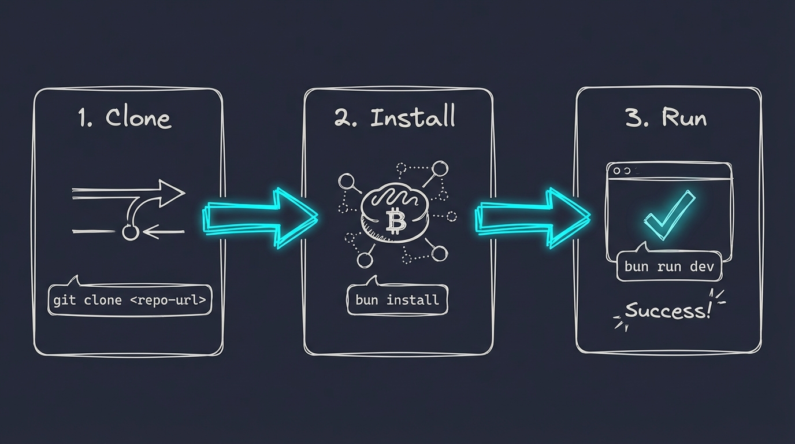

# Installation Guide

This guide will help you install PAI-OpenCode in under 5 minutes.



## Quick Install (Recommended)

```bash
# 1. Clone PAI-OpenCode
git clone https://github.com/Steffen025/pai-opencode.git
cd pai-opencode

# 2. Run the Installation Wizard
bun run .opencode/PAIOpenCodeWizard.ts

# 3. Start OpenCode
opencode
```

The wizard will:
1. ✅ Check prerequisites (Go, Bun)
2. ✅ Install OpenCode if missing
3. ✅ Set up your identity (name, AI assistant name, timezone)
4. ✅ Configure your AI provider (8 options: Anthropic, OpenAI, Google, Groq, AWS Bedrock, Azure, ZEN free, Ollama)
5. ✅ Create all necessary configuration files

**Takes ~2 minutes.**

---

## Prerequisites

Before running the wizard, ensure you have:

1. **Bun** - JavaScript/TypeScript runtime
   ```bash
   curl -fsSL https://bun.sh/install | bash
   ```

2. **Go** (1.24+) - For building OpenCode
   - macOS: `brew install go`
   - Linux: [Download from go.dev](https://go.dev/dl/)

---

## Windows Installation (WSL)

**Native Windows is not yet supported.** Windows users can run PAI-OpenCode through WSL2 (Windows Subsystem for Linux).

### Why WSL?

PAI-OpenCode uses Unix-style paths and tools that don't work natively on Windows. WSL2 provides a full Linux environment where everything works out of the box.

### Step 1: Install WSL2

Open PowerShell as Administrator:

```powershell
wsl --install
```

Restart your computer when prompted. On first boot, create your Linux username and password.

### Step 2: Install Prerequisites in WSL

Open your WSL terminal (search "Ubuntu" in Start menu):

```bash
# Update packages
sudo apt update && sudo apt upgrade -y

# Install Go
sudo apt install golang-go -y

# Install Bun
curl -fsSL https://bun.sh/install | bash
source ~/.bashrc
```

### Step 3: Clone and Install PAI-OpenCode

**Important:** Clone inside the WSL filesystem, NOT in `/mnt/c/`

```bash
# Navigate to your WSL home directory
cd ~

# Clone the repository
git clone https://github.com/Steffen025/pai-opencode.git
cd pai-opencode

# Run the Installation Wizard
bun run .opencode/PAIOpenCodeWizard.ts

# Start OpenCode
opencode
```

### Accessing Files

Your WSL files are accessible from Windows Explorer at:
```
\\wsl$\Ubuntu\home\<your-username>\pai-opencode
```

Or open Explorer from WSL:
```bash
explorer.exe .
```

### Tips for WSL Users

- **VS Code:** Install the "WSL" extension to edit files directly in WSL
- **Terminal:** Windows Terminal provides a better WSL experience than the default
- **Performance:** Files in WSL filesystem (`~/`) are faster than `/mnt/c/`

---

## Manual Installation

If you prefer to install manually without the wizard:

**Step 1:** Install OpenCode
```bash
go install github.com/opencode-ai/opencode@latest
```

**Step 2:** Clone the repository
```bash
git clone https://github.com/Steffen025/pai-opencode.git
cd pai-opencode
```

**Step 3:** Install dependencies
```bash
bun install
```

**Step 4:** Create symlink to connect OpenCode with PAI
```bash
# Remove the empty .opencode folder that OpenCode created
rm -rf ~/.opencode

# Create symlink from your home directory to your PAI-OpenCode installation
ln -s $(pwd)/.opencode ~/.opencode
```

**Step 5:** Launch OpenCode
```bash
opencode
```

**Note:** OpenCode automatically connects to the **ZEN provider** (free models) on first run. No API key required to get started! However, for full PAI functionality (agents, advanced features), you'll need to configure your own API keys. See [API Configuration](#api-configuration) below.

---

## Migrating from Claude Code PAI?

If you already have a PAI installation on Claude Code, see our [Migration Guide](docs/MIGRATION.md) for step-by-step instructions on transferring your skills, agents, and memory.

## First Run Verification

After installation, verify everything works:

1. **Check Skills Loading**
   - On first message, CORE skill should auto-load
   - Ask: "What skills do I have?"

2. **Test an Agent**
   ```
   @Intern hello
   ```

3. **Verify Plugins**
   - Check: `tail -f /tmp/pai-opencode-debug.log`
   - Should show: "PAI-OpenCode Plugin Loaded"

## Troubleshooting

### "Command not found: opencode"

Ensure `$GOPATH/bin` is in your PATH:
```bash
export PATH=$PATH:$(go env GOPATH)/bin
```

Add to your `.bashrc` or `.zshrc` for persistence.

### "Bun command not found"

Restart your terminal after installing Bun, or manually source:
```bash
source ~/.bashrc  # or ~/.zshrc
```

### Skills Not Loading

Check `.opencode/skills/` directory exists and contains `SKILL.md` files:
```bash
ls -la .opencode/skills/*/SKILL.md
```

### Plugin Errors

Check debug log for errors:
```bash
cat /tmp/pai-opencode-debug.log
```

## Configuration

### Environment Variables

Edit `.opencode/settings.json`:
```json
{
  "env": {
    "ENGINEER_NAME": "YourName",
    "TIME_ZONE": "Europe/Berlin",
    "DA": "YourAssistantName"
  }
}
```

---

## API Configuration

### Understanding the Setup

PAI-OpenCode has **two levels of AI usage**:

| Level | What Uses It | Default | Full Functionality |
|-------|--------------|---------|-------------------|
| **Main Agent** | Your primary AI assistant | ZEN (free) | Any provider |
| **Sub-Agents** | Intern, Architect, Engineer, etc. | Anthropic (hardcoded) | Requires Anthropic API key |

**Out of the box:** The main agent works with ZEN's free models. But sub-agents (spawned via Task tool) are hardcoded to use Anthropic's API.

### Option A: Use Your Claude Pro/Max Subscription (Recommended)

**Already have a Claude Pro or Max subscription?** You can use it directly with OpenCode - no API costs!

OpenCode supports connecting to your existing Anthropic subscription. This is the most cost-effective option if you're already paying for Claude.

1. **Connect your subscription:**
   ```
   /login
   ```
   This opens a browser for authentication with your Anthropic account.

2. **Select Claude provider:**
   ```
   /provider anthropic
   ```

3. **Done!** Both main agent and sub-agents use your Claude subscription.

**Benefits:**
- No additional API costs
- Uses your existing Claude Pro/Max quota
- Full access to Claude Opus, Sonnet, Haiku

---

### Option B: Use Anthropic API

If you prefer the API (pay-per-use) instead of subscription:

1. **Configure OpenCode for Anthropic API:**
   ```bash
   opencode config
   # Select: anthropic
   # Enter your API key from console.anthropic.com
   ```

2. **Done!** Both main agent and sub-agents use your Anthropic API key.

**Note:** API pricing is per-token. Check [anthropic.com/pricing](https://anthropic.com/pricing) for current rates.

---

### Option C: Use Different Providers

If you want to use a different provider (OpenAI, Groq, etc.):

1. **Configure main agent:**
   ```bash
   opencode config
   # Select your preferred provider
   # Enter your API key
   ```

2. **Reconfigure sub-agents:** Sub-agents are defined in skill files with hardcoded model references. To change them:

   **Quick Setup Prompt** - Copy this into a new PAI-OpenCode session:
   ```
   I want to configure PAI-OpenCode for my setup:
   - My name: [YOUR_NAME]
   - AI assistant name: [ASSISTANT_NAME]
   - My provider: [anthropic/openai/groq/etc.]
   - My preferred model: [model-name]

   Please update:
   1. settings.json with my identity
   2. All Task tool calls in skills to use my provider/model
   3. Any hardcoded model references
   ```

3. **Manual agent reconfiguration:**

   Search for hardcoded model references:
   ```bash
   grep -r "model.*sonnet\|model.*haiku\|model.*opus" .opencode/skills/
   ```

   Update each reference to your preferred model.

### API Keys Location

| Provider | Where to Get Key | Models |
|----------|-----------------|--------|
| Anthropic | https://console.anthropic.com/ | Claude Sonnet, Haiku, Opus |
| OpenAI | https://platform.openai.com/api-keys | GPT-4o, GPT-4o-mini, o1 |
| Google | https://aistudio.google.com/apikey | Gemini 2.0 Flash |
| xAI | https://console.x.ai/ | Grok 2 |
| Groq | https://console.groq.com/keys | Llama 3.3, Mixtral (fast!) |

**Note:** OpenAI's ChatGPT Plus subscription ($20/mo) does **not** include API access. You need a separate API key.

---

## Next Steps

- Read [docs/WHAT-IS-PAI.md](docs/WHAT-IS-PAI.md) for PAI fundamentals
- Explore [docs/OPENCODE-FEATURES.md](docs/OPENCODE-FEATURES.md) for OpenCode features
- Check [ROADMAP.md](ROADMAP.md) for upcoming features

## Getting Help

- **Documentation**: [docs/](docs/)
- **Issues**: [GitHub Issues](https://github.com/Steffen025/pai-opencode/issues)
- **Discussions**: [GitHub Discussions](https://github.com/Steffen025/pai-opencode/discussions)

---

**Installed successfully?** Give us a star on GitHub!
