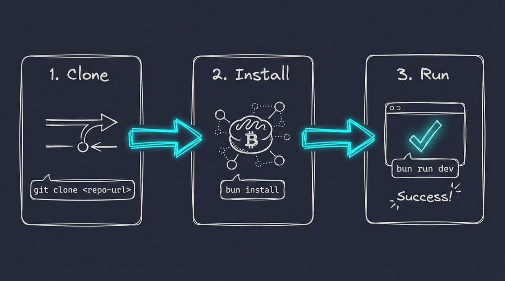

# Installation Guide

This guide will help you install PAI-OpenCode in under 5 minutes.



---

## Prerequisites

Before running the wizard, ensure you have:

1. **Git** — For cloning the repository
   - macOS: `brew install git`
   - Linux: `sudo apt install git`
   - Usually pre-installed on most systems

2. **Bun** — JavaScript/TypeScript runtime
   ```bash
   curl -fsSL https://bun.sh/install | bash
   ```

3. **Go** (1.24+) — For building OpenCode from source (required for model tiers)
   - macOS: `brew install go`
   - Linux: [Download from go.dev](https://go.dev/dl/)

---

## Quick Install (Recommended)

```bash
# 1. Clone PAI-OpenCode
git clone https://github.com/Steffen025/pai-opencode.git
cd pai-opencode

# 2. Run the Installation Wizard
bun run .opencode/PAIOpenCodeWizard.ts

# 3. Start OpenCode
opencode
```

The wizard will:
1. ✅ Check prerequisites (git, bun, go)
2. ✅ **Build OpenCode from dev source** (required for model tiers feature)
3. ✅ Ask you to choose a preset:
   - **Anthropic Max** (recommended) — Best quality, full PAI experience
   - **ZEN PAID** — Budget-friendly, paid tier models
   - **ZEN FREE** — Try it out, free tier models
4. ✅ Configure research agents (optional)
5. ✅ Set up your identity (name, AI assistant name, timezone)
6. ✅ Generate all configuration files

**Takes ~2-3 minutes.**

---

## Existing OpenCode Users

Already have OpenCode with `~/.opencode`? PAI-OpenCode uses a symlink approach so your config lives in a git repo:

```bash
# 1. Clone PAI-OpenCode
git clone https://github.com/Steffen025/pai-opencode.git
cd pai-opencode

# 2. Back up your existing config
mv ~/.opencode ~/.opencode.backup

# 3. Symlink PAI-OpenCode to your home directory
ln -s $(pwd)/.opencode ~/.opencode

# 4. Run the wizard (copies nothing — works in place)
bun run .opencode/PAIOpenCodeWizard.ts

# 5. Start OpenCode
opencode
```

**Why symlink?** Your config lives in a repo you control. Upgrades are just `git pull`. Rollback is switching the symlink back.

**Want to restore your old config?**
```bash
rm ~/.opencode
mv ~/.opencode.backup ~/.opencode
```

---

## Windows Installation (WSL)

**Native Windows is not yet supported.** Windows users can run PAI-OpenCode through WSL2 (Windows Subsystem for Linux).

### Why WSL?

PAI-OpenCode uses Unix-style paths and tools that don't work natively on Windows. WSL2 provides a full Linux environment where everything works out of the box.

### Step 1: Install WSL2

Open PowerShell as Administrator:

```powershell
wsl --install
```

Restart your computer when prompted. On first boot, create your Linux username and password.

### Step 2: Install Prerequisites in WSL

Open your WSL terminal (search "Ubuntu" in Start menu):

```bash
# Update packages
sudo apt update && sudo apt upgrade -y

# Install Git and Go
sudo apt install git golang-go -y

# Install Bun
curl -fsSL https://bun.sh/install | bash
source ~/.bashrc
```

### Step 3: Clone and Install PAI-OpenCode

**Important:** Clone inside the WSL filesystem, NOT in `/mnt/c/`

```bash
# Navigate to your WSL home directory
cd ~

# Clone the repository
git clone https://github.com/Steffen025/pai-opencode.git
cd pai-opencode

# Run the Installation Wizard
bun run .opencode/PAIOpenCodeWizard.ts

# Start OpenCode
opencode
```

### Accessing Files

Your WSL files are accessible from Windows Explorer at:
```
\\wsl$\Ubuntu\home\<your-username>\pai-opencode
```

Or open Explorer from WSL:
```bash
explorer.exe .
```

### Tips for WSL Users

- **VS Code:** Install the "WSL" extension to edit files directly in WSL
- **Terminal:** Windows Terminal provides a better WSL experience than the default
- **Performance:** Files in WSL filesystem (`~/`) are faster than `/mnt/c/`

---

## Post-Installation

After installation, see [ADVANCED-SETUP.md](docs/ADVANCED-SETUP.md) for:
- Custom provider configuration (beyond the 3 presets)
- Multi-provider research setup
- Voice server configuration
- Observability dashboard
- Custom agent creation

---

## Manual Installation

If you prefer to install manually without the wizard:

**Step 1:** Install OpenCode from dev source (required for model tiers)
```bash
# Clone OpenCode
cd /tmp
git clone https://github.com/anomalyco/opencode.git
cd opencode

# Build from dev source
go build -o opencode .

# Move to PATH
sudo mv opencode /usr/local/bin/
```

**Step 2:** Clone the PAI-OpenCode repository
```bash
git clone https://github.com/Steffen025/pai-opencode.git
cd pai-opencode
```

**Step 3:** Install dependencies
```bash
bun install
```

**Step 4:** Create symlink to connect OpenCode with PAI
```bash
# Remove the empty .opencode folder that OpenCode created
rm -rf ~/.opencode

# Create symlink from your home directory to your PAI-OpenCode installation
ln -s $(pwd)/.opencode ~/.opencode
```

**Step 5:** Launch OpenCode
```bash
opencode
```

**Note:** OpenCode automatically connects to the **ZEN provider** (free models) on first run. No API key required to get started! However, for full PAI functionality (agents, advanced features), you'll need to configure your own API keys. See [API Configuration](#api-configuration) below.

---

## Migrating from Claude Code PAI?

If you already have a PAI installation on Claude Code, see our [Migration Guide](docs/MIGRATION.md) for step-by-step instructions on transferring your skills, agents, and memory.

---

## First Run Verification

After installation, verify everything works:

1. **Check Skills Loading**
   - On first message, CORE skill should auto-load
   - Ask: "What skills do I have?"

2. **Test an Agent**
   ```
   @Intern hello
   ```

3. **Verify Plugins**
   - Check: `tail -f /tmp/pai-opencode-debug.log`
   - Should show: "PAI-OpenCode Plugin Loaded"

---

## Troubleshooting

### "Command not found: opencode"

Ensure `$GOPATH/bin` is in your PATH:
```bash
export PATH=$PATH:$(go env GOPATH)/bin
```

Add to your `.bashrc` or `.zshrc` for persistence.

### "Bun command not found"

Restart your terminal after installing Bun, or manually source:
```bash
source ~/.bashrc  # or ~/.zshrc
```

### Skills Not Loading

Check `.opencode/skills/` directory exists and contains `SKILL.md` files:
```bash
ls -la .opencode/skills/*/SKILL.md
```

### Plugin Errors

Check debug log for errors:
```bash
cat /tmp/pai-opencode-debug.log
```

### Model Tiers Not Working

**Error: `model_tiers is not a valid property`**

This means you have the **stable OpenCode installed**. The dev build is required for model tier support.

**Fix:**
```bash
# Remove the stable version
rm $(which opencode)

# Run the wizard which builds from dev source
bun run .opencode/PAIOpenCodeWizard.ts
```

> **Note:** The wizard builds OpenCode from source by default. If you see the error above, re-run the wizard to ensure dev build is installed.

---

## Configuration

### Environment Variables

Edit `.opencode/settings.json`:
```json
{
  "env": {
    "ENGINEER_NAME": "YourName",
    "TIME_ZONE": "Europe/Berlin",
    "DA": "YourAssistantName"
  }
}
```

---

## Provider Configuration

### The Three Presets

PAI-OpenCode uses a **preset system** for simplicity:

| Preset | Best For | Models | Cost |
|--------|----------|--------|------|
| **Anthropic Max** | Best quality | Claude Opus 4.6, Sonnet 4.5 | ~$75/1M tokens |
| **ZEN PAID** | Budget-friendly | GLM 4.7, Kimi K2.5, Gemini Flash | ~$1-15/1M tokens |
| **ZEN FREE** | Trying it out | Free tier | **FREE** |

### Switching Presets

```bash
# Re-run the wizard to change preset
bun run .opencode/PAIOpenCodeWizard.ts
```

### Advanced Provider Setup

For custom provider configuration beyond the 3 presets, see [ADVANCED-SETUP.md](docs/ADVANCED-SETUP.md).

### Multi-Provider Research (Optional)

For richer research results from diverse AI perspectives:

```bash
bun run .opencode/tools/switch-provider.ts --add-researchers
```

This adds research agents to your configuration. Requires additional API keys in `~/.opencode/.env`:
```bash
GOOGLE_API_KEY=your_key        # GeminiResearcher
XAI_API_KEY=your_key           # GrokResearcher
PERPLEXITY_API_KEY=your_key    # PerplexityResearcher
OPENROUTER_API_KEY=your_key    # CodexResearcher
```

Check which keys you have:
```bash
bun run .opencode/tools/switch-provider.ts --researchers
```

### Authentication Options

| Method | How | Best For |
|--------|-----|----------|
| **Subscription login** | Run `/login` in OpenCode | Claude Pro/Max, ChatGPT Plus users |
| **API key** | Add to `~/.opencode/.env` | Pay-per-use, multiple providers |
| **ZEN free** | No setup needed | Trying PAI-OpenCode |
| **Ollama local** | `ollama serve` | Privacy, offline use |

### API Keys for Multi-Provider Research (Optional)

The 3-preset system covers most use cases. For multi-provider research or custom providers, see [ADVANCED-SETUP.md](docs/ADVANCED-SETUP.md).

| Provider | Where to Get Key | For |
|----------|-----------------|-----|
| Anthropic | https://console.anthropic.com/ | Claude models (via Anthropic Max) |
| Google | https://aistudio.google.com/apikey | GeminiResearcher |
| xAI | https://console.x.ai/ | GrokResearcher |
| Perplexity | https://perplexity.ai/settings/api | PerplexityResearcher |
| OpenRouter | https://openrouter.ai/keys | CodexResearcher |

---

## Optional Services

### Voice Server (TTS Notifications)

Enable spoken notifications for task completions and agent results:

```bash
# Start the voice server
cd .opencode/voice-server
bun run server.ts
```

**Supported TTS Providers:**
1. **ElevenLabs** (default) - High-quality voices, requires API key
2. **Google Cloud TTS** - Alternative, requires API key
3. **macOS `say`** - Free fallback, built-in

Configure in `.opencode/.env`:
```bash
TTS_PROVIDER=elevenlabs
ELEVENLABS_API_KEY=your_key_here
```

See [.opencode/voice-server/README.md](.opencode/voice-server/README.md) for details.

### Observability Dashboard

Monitor sessions, tools, and agents in real-time:

```bash
# Start the observability server
cd .opencode/observability-server
bun run server.ts
```

Dashboard available at `http://localhost:8889`

**Features:**
- Real-time event streaming via SSE
- Session lifecycle tracking
- Tool usage analytics
- Agent spawn monitoring
- Vue 3 dashboard with GitHub Dark theme

See [.opencode/observability-server/README.md](.opencode/observability-server/README.md) for details.

---

## Next Steps

- Read [docs/WHAT-IS-PAI.md](docs/WHAT-IS-PAI.md) for PAI fundamentals
- Explore [docs/OPENCODE-FEATURES.md](docs/OPENCODE-FEATURES.md) for OpenCode features
- Check [ROADMAP.md](ROADMAP.md) for upcoming features
- See [ADVANCED-SETUP.md](docs/ADVANCED-SETUP.md) for custom configuration

---

## Getting Help

- **Documentation**: [docs/](docs/)
- **Issues**: [GitHub Issues](https://github.com/Steffen025/pai-opencode/issues)
- **Discussions**: [GitHub Discussions](https://github.com/Steffen025/pai-opencode/discussions)

---

**Installed successfully?** Give us a star on GitHub!
