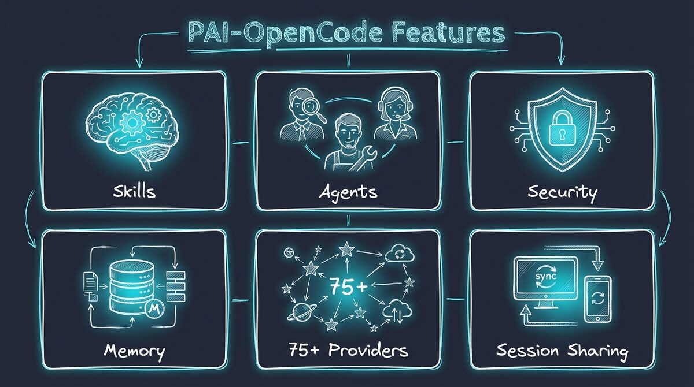

# PAI-OpenCode

**Personal AI Infrastructure for OpenCode** — Bring Daniel Miessler's renowned PAI scaffolding to any AI provider.

[](CHANGELOG.md)
[](https://github.com/anomalyco/opencode)
[](https://github.com/danielmiessler/Personal_AI_Infrastructure)
[](LICENSE)

> **v1.3 Release** — Multi-Provider Agent System with Dynamic Tier Routing. Every agent scales to the right model for the task. Choose your preset: `zen-paid`, `openrouter`, or `local-ollama`. See [CHANGELOG.md](CHANGELOG.md).

---

## What is this?

PAI-OpenCode is the complete port of **Daniel Miessler's Personal AI Infrastructure (PAI)** to **OpenCode** — an open-source, provider-agnostic AI coding assistant.


**PAI** is a scaffolding system that makes AI assistants work better for *you*. It's not about which model you use — it's about the infrastructure around it:

- **Skills** — Modular capabilities (code review, security testing, research, design)
- **Agents** — Dynamic multi-agent orchestration
- **Memory** — Session history, project context, learning loops
- **Plugins** — Lifecycle automation (session init, security validation, observability)

**OpenCode** is an open-source alternative to Claude Code that supports 75+ AI providers — from Anthropic and OpenAI to Google, AWS Bedrock, Ollama, and beyond.

**PAI-OpenCode** = The best of both worlds.

---

## Why PAI-OpenCode?

| Challenge | Solution |
|-----------|----------|
| **PAI was built for Claude Code** (Anthropic only) | PAI-OpenCode works with **any AI provider** |
| **Vendor lock-in** limits your options | Switch providers freely while keeping your infrastructure |
| **Generic AI assistants** don't know your workflow | PAI's skills, memory, and plugins personalize to *your* needs |
| **One-shot interactions** lose context | PAI's memory system builds knowledge over time |

**The scaffolding is more important than the model.** PAI-OpenCode gives you:

✅ Provider freedom (Claude, GPT-4, Gemini, Llama, etc.)
✅ Full PAI infrastructure (skills, agents, memory, plugins)
✅ Real-time session sharing (OpenCode feature)
✅ Terminal + Desktop + Web clients
✅ Community-driven, open-source foundation

---

## Quick Start

```bash
# 1. Clone PAI-OpenCode
git clone https://github.com/Steffen025/pai-opencode.git
cd pai-opencode

# 2. Run the Installation Wizard
bun run .opencode/PAIOpenCodeWizard.ts

# 3. Start OpenCode
opencode
```

> **Already using OpenCode?** If you have an existing `~/.opencode` directory, see [Existing OpenCode Users](#existing-opencode-users) in the Installation Guide for symlink setup.

The wizard will ask you to:
- **Choose your preset** — `zen-paid` (recommended), `openrouter` (provider diversity), or `local-ollama` (fully offline)
- Configure research agents (optional)
- Set your name and timezone
- Name your AI assistant

**Takes ~2 minutes** and creates all necessary configuration files.

---

## Deep Personalization (Recommended)

After running the wizard, start OpenCode and paste this prompt for full personalization:

```
Let's do the onboarding. Guide me through setting up my personal context -
my name, my goals, my values, and how I want you to behave. Create the TELOS
and identity files that make this AI mine.
```

This **10-15 minute** interactive session will configure your complete TELOS framework:

| What Gets Created | Purpose |
|-------------------|---------|
| **Mission & Goals** | Your life purposes and specific objectives |
| **Challenges & Strategies** | What's blocking you and how to overcome it |
| **Values & Beliefs** | Core principles that guide decisions |
| **Narratives** | Your key talking points and messages |
| **Tech Preferences** | Languages, frameworks, tools you prefer |

**Why TELOS matters:** PAI becomes exponentially more useful when it knows your context. Generic AI gives generic advice. PAI with TELOS gives *you-specific* guidance.

---

## Features



### 🎯 Skills System (29 Skills)
Modular, reusable capabilities invoked by name:
- **CORE** — Identity, preferences, auto-loaded at session start
- **Art** — Excalidraw-style visual diagrams
- **Browser** — Code-first browser automation
- **Security** — Pentesting, secret scanning
- **Research** — Cost-aware multi-provider research system (see below)

### 🤖 Agent Orchestration (16 Agents)
Dynamic multi-agent composition with **intelligent tier routing** — every agent scales up or down based on task complexity:

| Agent | Default | Scales Down To | Scales Up To |
|-------|---------|----------------|--------------|
| **Algorithm** | Claude Opus 4.6 | — | — |
| **Architect** | Kimi K2.5 | GLM 4.7 (quick review) | Claude Opus 4.6 (complex architecture) |
| **Engineer** | Kimi K2.5 | GLM 4.7 (batch edits) | Claude Sonnet 4.5 (complex debugging) |
| **DeepResearcher** | GLM 4.7 | MiniMax (quick lookup) | Kimi K2.5 (deep analysis) |
| **GeminiResearcher** | Gemini 3 Flash | — | Gemini 3 Pro (deep research) |
| **PerplexityResearcher** | Sonar | — | Sonar Deep Research |
| **GrokResearcher** | Grok 4.1 Fast | — | Grok 4.1 (full analysis) |
| **CodexResearcher** | GPT-5.1 Codex Mini | — | GPT-5.2 Codex |
| **Writer** | Gemini 3 Flash | MiniMax (quick drafts) | Claude Sonnet 4.5 (premium copy) |
| **Pentester** | Kimi K2.5 | GLM 4.7 (quick scan) | Claude Sonnet 4.5 (deep audit) |
| **Intern** | MiniMax M2.1 | — | — |
| **Explore** | MiniMax M2.1 | — | — |
| **QATester** | GLM 4.7 | — | — |
| **Designer** | Kimi K2.5 | GLM 4.7 | Claude Sonnet 4.5 |
| **Artist** | Kimi K2.5 | GLM 4.7 | Claude Sonnet 4.5 |
| **General** | GLM 4.7 | MiniMax | Kimi K2.5 |

The orchestrator decides per task which model tier to use. You always pay exactly what the task requires.

### 🧠 Memory & Learning
Persistent context across sessions:
- Session transcripts (`.opencode/MEMORY/SESSIONS/`)
- Project documentation (`.opencode/MEMORY/projects/`)
- Learning loops (`.opencode/MEMORY/LEARNINGS/`)

### 🔧 Plugin System (14 Handlers)
TypeScript lifecycle plugins with comprehensive coverage:
- **Context injection** at session start
- **Security validation** before commands
- **Voice notifications** (ElevenLabs + Google TTS + macOS say)
- **Implicit sentiment** detection from user messages
- **Tab state** updates for Kitty terminal
- **ISC tracking** and response capture
- **Rating capture** and learning loops
- **Observability** (real-time event streaming and monitoring)

### 🌐 75+ AI Providers
Use any AI provider:
- Anthropic (Claude)
- OpenAI (GPT-4)
- Google (Gemini)
- AWS Bedrock
- Groq, Mistral, Ollama, and more...

---

## Provider Preset System

PAI-OpenCode offers **three presets** — each gives you access to 75+ providers with different routing strategies:

| Preset | Best For | Providers | Cost |
|--------|----------|-----------|------|
| **`zen-paid`** (Recommended) | Production use, privacy-conscious | 75+ providers via Zen AI Gateway | ~$1-75/1M tokens depending on tier |
| **`openrouter`** | Provider diversity, experimental models | OpenRouter routing to 100+ models | Varies by model |
| **`local-ollama`** | Full privacy, offline operation | Local Ollama instance | **FREE** (your hardware) |

### Why This Design?

The key insight is **dynamic multi-provider routing within a single session**. Unlike tools locked to one provider, PAI-OpenCode can:

- Route the orchestrator to Anthropic (Opus 4.6) for complex decisions
- Route research agents to Zen (GLM 4.7, Kimi K2.5) for cost-effective search
- Route real-time queries to Perplexity (Sonar) for breaking news
- All in the **same task**, automatically

This is what PAI on OpenCode can do that PAI on Claude Code cannot — Claude Code is locked to Anthropic only.

**Easy to customize** later via [ADVANCED-SETUP.md](docs/ADVANCED-SETUP.md)

### Switching Presets

```bash
# Re-run the wizard to change preset
bun run .opencode/PAIOpenCodeWizard.ts
```

---

## Model Tiers

Each agent uses a **3-tier model strategy** — the orchestrator selects the right tier based on task complexity:

| Tier | Purpose | Use Case |
|------|---------|----------|
| **Quick** | Fast, cheap tasks | Batch edits, simple replacements, file search |
| **Standard** | Most work | Feature implementation, research, bug fixes |
| **Advanced** | Complex reasoning | Edge cases, architecture decisions, debugging |

### Dynamic Tier Routing in Practice

The **same agent** uses different models depending on the task:

| Task | Agent | Tier | Model | Why |
|------|-------|------|-------|-----|
| Batch rename files | Engineer | `quick` | GLM 4.7 | Simple mechanical work |
| Implement auth middleware | Engineer | `standard` | Kimi K2.5 | Real coding task |
| Debug race condition | Engineer | `advanced` | Claude Sonnet 4.5 | Complex reasoning needed |
| Quick web lookup | DeepResearcher | `quick` | MiniMax | Simple fact check |
| Strategic market analysis | DeepResearcher | `standard` | GLM 4.7 | Multi-step research |
| Deep technical investigation | DeepResearcher | `advanced` | Kimi K2.5 | Large context, complex synthesis |

The orchestrator automatically selects the tier via the `model_tier` parameter in Task tool calls. You pay for exactly what the task requires — no more, no less.

> **Note:** Model tier routing is configured in `opencode.json`. The orchestrator makes the decision per task based on complexity assessment.

---

## Cost-Aware Research System

PAI-OpenCode includes a **3-tier research system** that optimizes for both quality and cost:

| Tier | Workflow | Agents | Cost | Trigger |
|------|----------|--------|------|---------|
| **Quick** (DEFAULT) | `QuickResearch` | 1 agent | **$0 FREE** | "research X" |
| **Standard** | `StandardResearch` | 3 (Claude + Gemini + Perplexity) | ~$0.01 | "standard research" |
| **Extensive** | `ExtensiveResearch` | 4-5 providers | ~$0.10-0.50 | "extensive research" |

### Why This Matters

**Quick Research is FREE** — Uses free tier or cached results. No API keys needed for basic queries.

**Standard Research** adds multi-perspective coverage with Gemini and Perplexity for ~$0.01 per query.

**Extensive Research** requires explicit confirmation before running (cost gate) to prevent unexpected charges.

### Available Research Agents

| Agent | Model | Specialty | Cost |
|-------|-------|-----------|------|
| `DeepResearcher` | Configured in `opencode.json` | Academic depth, scholarly synthesis | Free/Paid |
| `GeminiResearcher` | Gemini 2.5 Flash | Multi-perspective analysis | ~$0.002 |
| `GrokResearcher` | xAI Grok 4.1 Fast | Contrarian, social media, X access | ~$0.01 |
| `PerplexityResearcher` | Perplexity Sonar | Real-time news, breaking events | ~$0.01 |
| `CodexResearcher` | GPT-4.1 / GPT-5.1 | Technical, TypeScript-focused | ~$0.03 |

### Setup

**Option 1: Wizard** — The installation wizard asks about research configuration during setup.

**Option 2: CLI** — Add research agents anytime:
```bash
bun run .opencode/tools/switch-provider.ts --add-researchers
```

**Required API keys** (add to `~/.opencode/.env`):
| Key | For | Where to get |
|-----|-----|-------------|
| `GOOGLE_API_KEY` | GeminiResearcher | https://aistudio.google.com/apikey |
| `XAI_API_KEY` | GrokResearcher | https://console.x.ai/ |
| `PERPLEXITY_API_KEY` | PerplexityResearcher | https://perplexity.ai/settings/api |
| `OPENROUTER_API_KEY` | CodexResearcher | https://openrouter.ai/keys |

Missing a key? No problem — that researcher falls back to your primary provider.

---

## Architecture

PAI-OpenCode's design is documented through **Architecture Decision Records (ADRs)**—formal documents explaining *why* we made specific choices during the port from Claude Code to OpenCode.

| ADR | Decision | Why It Matters |
|-----|----------|----------------|
| [ADR-001](docs/architecture/adr/ADR-001-hooks-to-plugins-architecture.md) | Hooks → Plugins | OpenCode uses in-process plugins, not subprocess hooks |
| [ADR-002](docs/architecture/adr/ADR-002-directory-structure-claude-to-opencode.md) | `.claude/` → `.opencode/` | Platform directory convention |
| [ADR-003](docs/architecture/adr/ADR-003-skills-system-unchanged.md) | Skills System Unchanged | Preserves upstream PAI compatibility |
| [ADR-004](docs/architecture/adr/ADR-004-plugin-logging-file-based.md) | File-Based Logging | Prevents TUI corruption from console.log |
| [ADR-005](docs/architecture/adr/ADR-005-configuration-dual-file-approach.md) | Dual Config Files | PAI settings.json + OpenCode opencode.json |
| [ADR-006](docs/architecture/adr/ADR-006-security-validation-preservation.md) | Security Patterns Preserved | Critical security validation unchanged |
| [ADR-007](docs/architecture/adr/ADR-007-memory-system-structure-preserved.md) | Memory Structure Preserved | File-based MEMORY/ system unchanged |

**Key Principles:**
- **Preserve PAI's design** where possible
- **Adapt to OpenCode** where necessary
- **Document every change** in ADRs

---

## Documentation

| Document | Description |
|----------|-------------|
| [CHANGELOG.md](CHANGELOG.md) | Version history and release notes |
| [docs/WHAT-IS-PAI.md](docs/WHAT-IS-PAI.md) | PAI fundamentals explained |
| [docs/OPENCODE-FEATURES.md](docs/OPENCODE-FEATURES.md) | OpenCode unique features |
| [docs/PLUGIN-SYSTEM.md](docs/PLUGIN-SYSTEM.md) | Plugin architecture (14 handlers) |
| [docs/PAI-ADAPTATIONS.md](docs/PAI-ADAPTATIONS.md) | Changes from PAI 2.5 |
| [docs/MIGRATION.md](docs/MIGRATION.md) | Migration from Claude Code PAI |
| [ROADMAP.md](ROADMAP.md) | Version roadmap |
| [CONTRIBUTING.md](CONTRIBUTING.md) | Contribution guidelines |

**For Contributors:**
| Document | Description |
|----------|-------------|
| [PAI-to-OpenCode Mapping](.opencode/PAISYSTEM/PAI-TO-OPENCODE-MAPPING.md) | How to correctly import PAI components |

**Upstream Resources:**
- [Daniel Miessler's PAI](https://github.com/danielmiessler/Personal_AI_Infrastructure) — Original PAI documentation
- [OpenCode Documentation](https://docs.opencode.ai) — OpenCode official docs

---

## Credits

**PAI-OpenCode** stands on the shoulders of giants:

### Daniel Miessler — Personal AI Infrastructure
The original PAI vision and architecture. Daniel's work on personalized AI scaffolding is foundational to this project.
🔗 [github.com/danielmiessler/Personal_AI_Infrastructure](https://github.com/danielmiessler/Personal_AI_Infrastructure)

### Anomaly — OpenCode
The open-source, provider-agnostic runtime that makes PAI-OpenCode possible.
🔗 [github.com/anomalyco/opencode](https://github.com/anomalyco/opencode)
🔗 [docs.opencode.ai](https://docs.opencode.ai)

---

## License

MIT License — see [LICENSE](LICENSE) for details.

**PAI-OpenCode** is an independent port. Original PAI by Daniel Miessler, OpenCode by Anomaly.

---

## Get Started

```bash
git clone https://github.com/Steffen025/pai-opencode.git
cd pai-opencode && bun run .opencode/PAIOpenCodeWizard.ts && opencode
```

**Welcome to Personal AI Infrastructure, your way.**
