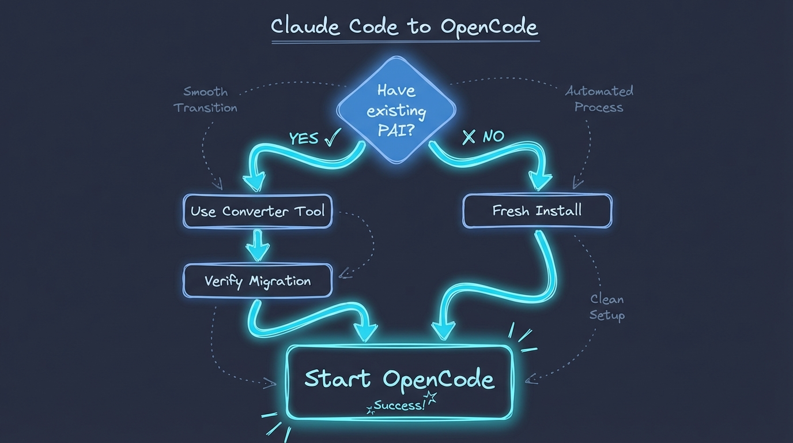

# PAI-OpenCode

[](https://github.com/Steffen025/pai-opencode)
[](LICENSE)
[](https://github.com/danielmiessler/PAI)

> A community-driven port of Daniel Miessler's PAI 2.3 from Claude Code to OpenCode


---

## New to PAI? Start Here

**PAI (Personal AI Infrastructure)** is an open-source scaffolding system by [Daniel Miessler](https://github.com/danielmiessler/PAI) that transforms AI coding assistants from unreliable chatbots into dependable, context-aware systems.

### The Core Insight: Scaffolding > Model


**The problem:** Raw AI models hallucinate, give inconsistent outputs, and forget context between sessions.

**The solution:** PAI wraps the AI in structured workflows, validation layers, and persistent memory - turning chaos into reliability.

### The AI Evolution (Why PAI is Different)

| Level | What It Does | Example |
|-------|--------------|---------|
| **Chatbots** | Ask → Answer → Forget | ChatGPT, vanilla Claude |
| **Agentic Platforms** | Ask → Use Tools → Get Result | Claude Code, Cursor, OpenCode |
| **PAI** | Observe → Think → Plan → Execute → Verify → **Learn** → Improve | This project |

The key difference: **Continuous learning and personal context retention.**

### PAI's Building Blocks

| Component | What It Does |
|-----------|--------------|
| **Skills** | Domain expertise that auto-activates on triggers ("security audit" → loads security skill) |
| **Agents** | Specialized AI personalities (Engineer, Architect, Researcher) that work in parallel |
| **Memory** | Learnings, decisions, and context that persist across sessions |
| **Hooks/Plugins** | Lifecycle events that inject context, block dangerous commands, capture history |

**Full documentation:** [danielmiessler/PAI](https://github.com/danielmiessler/PAI) - the original, authoritative source.

---

## What is PAI-OpenCode?

**This project ports PAI to [OpenCode](https://github.com/anomalyco/opencode)** - a community-driven migration proving that PAI's architecture transcends any single platform.

We're not just copying files. We're documenting every adaptation, solving platform differences, and creating a blueprint for porting PAI anywhere.

### Why Port PAI?

| Challenge | Our Solution |
|-----------|--------------|
| Hooks → Plugins | Unified TypeScript plugin with security blocking + context injection |
| Different lazy loading | Native OpenCode skill loading |
| Agent delegation differences | Hybrid Task API + subagent mapping |
| Session management | OpenCode-native storage + PAI memory layer |

**The result:** A working PAI 2.3 installation on OpenCode, with a converter tool that migrates 767 files in 5 seconds.

---

## Project Status

**Current Version:** v0.9.5 - P1 Fixes + Converter Expansion ✅

**v1.0 Status:** ⚠️ **BLOCKED** - Deep audit completed (2026-01-21). Root cause identified: converter migrates documentation but not implementation. System integrity at 69%. Estimated fix time: ~2-3 sessions (similar to previous iteration).

**Development Progress:**

| Milestone | Description | Status |
|-----------|-------------|--------|
| v0.1 | Foundation (Workspace + Git + Research) | ✅ DONE |
| v0.2 | Vanilla Install (PAI 2.0 packs) | ✅ DONE |
| v0.3 | Skills Translation (OpenCode lazy loading) | ✅ DONE |
| v0.4 | Agent Delegation (Hybrid Task API) | ✅ DONE |
| v0.4.2 | Agent Profiles (Provider switching) | ✅ DONE |
| v0.5 | Plugin Infrastructure (Hook→Plugin translation) | ✅ DONE |
| v0.6 | PAI 2.3 Alignment (Structure reset, MEMORY/, CORE split) | ✅ DONE |
| v0.7 | **Plugin Adapter** (Security blocking, context injection) | ✅ DONE |
| v0.8 | **Converter Tool** (PAI→OpenCode translator) | ✅ DONE |
| v0.9 | Integration Testing + Documentation | ✅ DONE |
| v0.9.1 | Agent Invocation Verification | ✅ DONE |
| v0.9.2 | Re-Audit & Corrections | ✅ DONE |
| v0.9.3 | Plural Directories + chat.message Hook | ✅ DONE |
| v0.9.4 | P0 Critical Fixes (Fresh Install Audit) | ✅ DONE |
| v0.9.5 | P1 Fixes + Converter v0.9.5 | ✅ DONE |
| v1.0 | **PUBLIC RELEASE** (Community-ready vanilla PAI 2.3) | ⏳ NEXT |

**Recent Achievements:**
- **v0.9.5:** P1 Fixes + Converter v0.9.5 - AgentProfileLoader, PentesterContext, Tools/ translation
- **v0.9.5 Deep Audit:** Root cause identified - converter scope gaps (hooks/, plugins/ not translated)
- **v0.9.4:** P0 Critical Fixes - 42 issues from fresh install audit fixed
- **v0.9.3:** Plural Directories + chat.message Hook - Aligned with PAI vanilla naming

### Milestone Highlights

**v0.9.1 - Agent Invocation Discovery**


Critical finding: `Task({subagent_type: "AgentName"})` works for AI-to-Agent delegation, while `@agentname` only works for user input.

**v0.8 - Automatic Migration Converter**


Converts entire PAI 2.x installation to OpenCode in 5 seconds. 767 files, zero manual edits.

**v0.7 - Plugin Adapter**


Security blocking, context injection, all 4 tests passing.

**v0.7 Resolved Issues:**
| Issue | Resolution |
|-------|------------|
| TUI Corruption | ✅ Fixed with file-only logging to `/tmp/pai-opencode-debug.log` |
| Security Blocking | ✅ Working via `tool.execute.before` + throw Error |
| Context Injection | ✅ Working via `experimental.chat.system.transform` |

**Deferred to v1.x (Post-Release):**
- Voice System (if not part of vanilla PAI 2.3 core)
- Observability Dashboard (community plugins phase)
- Ollama deep integration (local model support)
- Daniel Miessler's additional packs (importable via Converter)

**Full Roadmap:** See [ROADMAP.md](ROADMAP.md) for detailed milestone specifications.

---

## Scope

### What's IN Scope (v1.0)

This project is a **pure vanilla PAI 2.3 port** to OpenCode. We include:

✅ **All PAI 2.3 Core Components:**
- 8 kai-* packs (kai-core-install, kai-hook-system, etc.)
- Skills system with progressive disclosure (20+ skills)
- Agent delegation (13 named agents: Intern, Engineer, Architect, Designer, Pentester, etc.)
- COMPLETE History system (OpenCode sessions + PAI knowledge layer)
- Unified Plugin (security blocking + context injection)
- Constitutional framework and Two Loops architecture

✅ **Platform Adaptation Layer:**
- Converter tool for importing PAI updates
- Skill format translation for OpenCode lazy loading
- Hook → Plugin adaptation
- Documentation for community use

### What's OUT of Scope (v1.0)

This is **NOT a fork with modifications**. We exclude:

❌ **Personal Customizations:**
- User-specific identity layers (TELOS, Ideology)
- Custom business contexts
- Personal workflow adaptations
- Private tools and extensions

❌ **Platform-Specific Experiments:**
- Untested feature additions
- Performance optimizations beyond vanilla
- New capabilities not in PAI 2.0

### The Vanilla Principle

**v1.0 = Pure PAI 2.0 on OpenCode.** Nothing more, nothing less.

This ensures:
1. The port is a faithful reference implementation
2. Others can trust it as a starting point
3. Platform differences are clearly isolated
4. Personal extensions can be built on top (separately)

**After v1.0:** Personal customizations and extensions live in separate private projects, not in this public repository.

---

## Technical Approach

PAI-OpenCode makes **6 key technical decisions** documented in our Constitution:

| Decision | Approach | Rationale |
|----------|----------|-----------|
| **Configuration** | Clean Break + Converter | Maintain import capability, not backwards compatibility |
| **Agent Delegation** | Hybrid (Task API + Subagents) | PAI packs use Task tool, simple tasks use OpenCode native |
| **Skills Loading** | LazyLoad Translation | OpenCode supports native lazy loading |
| **Hook System** | DEFERRED (needs research) | Plugins fundamentally different from hooks—requires investigation |
| **History System** | OpenCode Sessions (v1.0) | Use native session storage for public port |
| **Directory Structure** | Clean `.opencode/` | Project-level config, not global, with converter for PAI updates |

**Guiding Principle:** *Import capability over backwards compatibility.* We build on OpenCode natively while maintaining the ability to import PAI 2.0 updates via our converter tool.



**Full Technical Decisions:** See [constitution.md](constitution.md) Section IX for detailed rationale.

---

## Getting Started

### Step 1: Install Prerequisites

**Install Bun** (JavaScript runtime):
```bash
curl -fsSL https://bun.sh/install | bash
source ~/.zshrc  # or ~/.bashrc
```

**Install OpenCode** (choose one):
```bash
# Option A: Via Go (recommended)
go install github.com/anomalyco/opencode@latest

# Option B: Build from source
git clone https://github.com/anomalyco/opencode.git
cd opencode && go build -o opencode . && sudo mv opencode /usr/local/bin/

# Option C: Download binary from releases
# https://github.com/anomalyco/opencode/releases
```

### Step 2: Install PAI-OpenCode

```bash
# Clone the repository
git clone https://github.com/Steffen025/pai-opencode.git
cd pai-opencode

# Install dependencies
bun install

# Start OpenCode with PAI
opencode
```

That's it! PAI 2.3 is now running on OpenCode with:
- 20+ skills (auto-loaded on triggers)
- 13 named agents (Intern, Engineer, Architect, Designer, Pentester, etc.)
- Unified Plugin (security blocking, context injection)

### Step 3: Choose Your AI Provider

PAI-OpenCode supports multiple AI providers. **No API key required for ZEN free models!**

| Provider | Models | Cost | API Key Required |
|----------|--------|------|------------------|
| **ZEN** (default) | Big Pickle, Grok Code Fast, GLM 4.7, MiniMax M2.1, GPT-5 Nano | **FREE** | ❌ No |
| Anthropic | Claude Opus/Sonnet/Haiku | Paid | ✅ Yes |
| OpenAI | GPT-4o, GPT-4o-mini | Paid | ✅ Yes |

**Using ZEN Free Models (Default - No Setup Needed!):**

ZEN models work out of the box. Just run `opencode` and start working!

See [OpenCode ZEN Documentation](https://opencode.ai/docs/zen/) for model details.

**Using Anthropic/OpenAI (Optional):**

If you prefer paid models, set your API key:
```bash
# For Anthropic:
export ANTHROPIC_API_KEY="sk-ant-api03-your-key-here"

# For OpenAI:
export OPENAI_API_KEY="sk-your-key-here"
```

Then configure your provider in `opencode.json`:
```json
{
  "pai": {
    "model_provider": "anthropic"
  }
}
```

### Step 4: Verify Installation

In OpenCode, try these commands:
- `/agents` - Should show 13 agents
- Ask: "Who are you?" - AI should identify as PAI
- Try: `@intern What is TypeScript?` - Agent should respond

### Step 5: For Existing PAI Users (Migration)

If you have an existing PAI installation on Claude Code, use the converter:

```bash
bun Tools/pai-to-opencode-converter.ts --source ~/.claude --target .opencode --dry-run
```

See [docs/CONVERTER.md](docs/CONVERTER.md) for detailed migration guide.

### Troubleshooting

**"opencode: command not found"**
```bash
# Check if Go bin is in PATH
export PATH="$PATH:$(go env GOPATH)/bin"
# Or check binary location
which opencode
```

**"ANTHROPIC_API_KEY not set"**
```bash
# Verify the key is set
echo $ANTHROPIC_API_KEY
# Should show: sk-ant-api03-...
```

**Plugin doesn't load**
```bash
# Check the debug log
cat /tmp/pai-opencode-debug.log
# Should show: "PAI-OpenCode Plugin Loaded"
```

**TUI corruption or display issues**
```bash
# Reset terminal and restart
reset
opencode
```

---

## Contributing

We welcome contributions! Here's how you can help:

### Ways to Contribute

- **Test the Migration**: Try installing PAI-OpenCode and report issues
- **Document Edge Cases**: Found a quirk? Document it for others
- **Improve Documentation**: Help make our guides clearer
- **Share Feedback**: Tell us what works and what doesn't
- **Report Bugs**: File issues with detailed reproduction steps

### Contribution Guidelines

1. **Read the Constitution**: Our [constitution.md](constitution.md) defines project principles and scope
2. **Check Existing Issues**: Avoid duplicates by searching first
3. **Stay Vanilla**: v1.0 is pure PAI 2.0—no custom features in this repo
4. **Document Thoroughly**: Explain your reasoning and decisions
5. **Test Before Submitting**: Ensure changes don't break existing functionality

### Code of Conduct

Be respectful, constructive, and collaborative. This is a community project—we're learning together.

---

## Credits & Acknowledgments

### Daniel Miessler - Original PAI Creator

This project would not exist without [Daniel Miessler's](https://github.com/danielmiessler) groundbreaking work on PAI (Personal AI Infrastructure). Daniel designed PAI's architecture, created the pack-and-bundle system, and pioneered the Two Loops methodology that makes sophisticated AI scaffolding possible.

**Original PAI Repository:** https://github.com/danielmiessler/PAI

PAI-OpenCode is a community-driven port that validates Daniel's vision of platform independence. All credit for PAI's core design, philosophy, and innovation belongs to Daniel.

### Port Maintainer

**Steffen** ([@Steffen025](https://github.com/Steffen025)) - PAI-OpenCode migration, documentation, and community contribution

### Research & Documentation

This port is based on comprehensive research (48-page synthesis) of PAI 2.0's architecture, pack system, and design principles. See `research/SYNTHESIS.md` for the complete analysis.

---

## License

**MIT License** - Same as the [original PAI repository](https://github.com/danielmiessler/PAI).

This project is open source and free to use, modify, and distribute. See [LICENSE](LICENSE) for details.

**In Daniel's words:**
> "Do whatever you want with this. Build on it, sell it, modify it. Just don't blame us if something breaks. Attribution appreciated but not required."

---

## Project Links

- **Repository:** https://github.com/Steffen025/pai-opencode
- **Issues:** https://github.com/Steffen025/pai-opencode/issues
- **Roadmap:** [ROADMAP.md](ROADMAP.md)
- **Constitution:** [constitution.md](constitution.md)
- **Research:** [research/SYNTHESIS.md](research/SYNTHESIS.md)

---

## Roadmap to v1.0

**PAI-OpenCode v1.0.0 will be released soon!** A complete, community-ready port of PAI 2.3 to OpenCode.

### What's Included

- **20+ Skills** with native OpenCode lazy loading
- **13 Named Agents** with Task API delegation (Intern, Engineer, Architect, etc.)
- **Unified Plugin** for security blocking and context injection
- **Converter Tool** for migrating existing PAI installations (767 files in 5 seconds)
- **Comprehensive Documentation** for getting started

### Known Limitations (OpenCode API)

Some PAI 2.3 features cannot be ported due to OpenCode's architecture:

| Feature | Reason | Impact |
|---------|--------|--------|
| User Input Interception | OpenCode `chat.message` hook added in v0.9.3 | Basic support available, advanced features pending |
| Tab Title Updates | OpenCode tab API not exposed | No dynamic tab titles |
| Rating Capture | Requires `UserPromptSubmit` | Explicit/implicit rating capture not available |

These are **OpenCode platform limitations**, not implementation gaps. See [docs/HOOK-MAPPING.md](docs/HOOK-MAPPING.md) for full details.

### Key Discovery: Agent Invocation in OpenCode

```
Task({subagent_type: "Intern"})     → ✅ AI-to-Agent delegation
Task({subagent_type: "Architect"})  → ✅ AI-to-Agent delegation
@architect (user types in input)    → ✅ User-to-Agent invocation
```

### Future Roadmap (Post v1.0)

- **Ollama Integration** - Local model support for complete data sovereignty
- **Voice System** - Audio notifications and feedback
- **Observability Dashboard** - Performance and usage insights
- **Additional PAI Packs** - Importable via the Converter tool

**Follow our progress:** Watch this repository or check [ROADMAP.md](ROADMAP.md) for milestone updates.

---

**PAI-OpenCode** - *Bringing Personal AI Infrastructure to OpenCode, for the community.*
