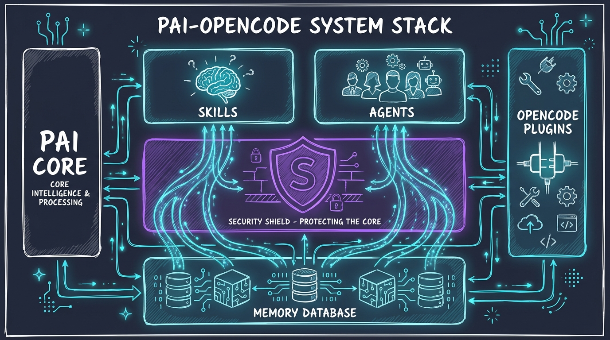
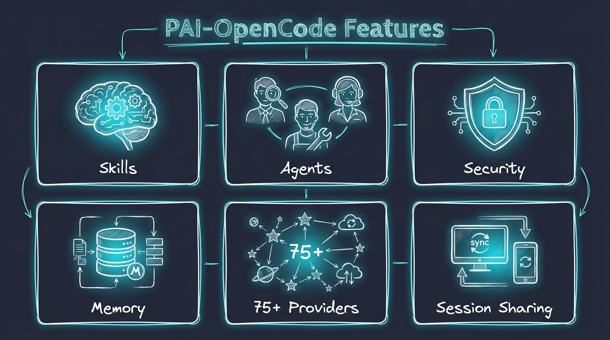

# PAI-OpenCode

**Personal AI Infrastructure for OpenCode** — Bring Daniel Miessler's renowned PAI scaffolding to any AI provider.

[](https://github.com/anomalyco/opencode)
[](https://github.com/danielmiessler/Personal_AI_Infrastructure)
[](LICENSE)

---

## What is this?

PAI-OpenCode is the complete port of **Daniel Miessler's Personal AI Infrastructure (PAI)** to **OpenCode** — an open-source, provider-agnostic AI coding assistant.



**PAI** is a scaffolding system that makes AI assistants work better for *you*. It's not about which model you use — it's about the infrastructure around it:

- **Skills** — Modular capabilities (code review, security testing, research, design)
- **Agents** — Dynamic multi-agent orchestration
- **Memory** — Session history, project context, learning loops
- **Plugins** — Lifecycle automation (session init, security validation, observability)

**OpenCode** is an open-source alternative to Claude Code that supports 75+ AI providers — from Anthropic and OpenAI to Google, AWS Bedrock, Ollama, and beyond.

**PAI-OpenCode** = The best of both worlds.

---

## Why PAI-OpenCode?

| Challenge | Solution |
|-----------|----------|
| **PAI was built for Claude Code** (Anthropic only) | PAI-OpenCode works with **any AI provider** |
| **Vendor lock-in** limits your options | Switch providers freely while keeping your infrastructure |
| **Generic AI assistants** don't know your workflow | PAI's skills, memory, and plugins personalize to *your* needs |
| **One-shot interactions** lose context | PAI's memory system builds knowledge over time |

**The scaffolding is more important than the model.** PAI-OpenCode gives you:

✅ Provider freedom (Claude, GPT-4, Gemini, Llama, etc.)
✅ Full PAI infrastructure (skills, agents, memory, plugins)
✅ Real-time session sharing (OpenCode feature)
✅ Terminal + Desktop + Web clients
✅ Community-driven, open-source foundation

---

## Quick Start

```bash
# 1. Clone PAI-OpenCode
git clone https://github.com/Steffen025/pai-opencode.git
cd pai-opencode

# 2. Install dependencies
bun install

# 3. Start OpenCode
opencode
```

**That's it.** Run `opencode` to start with full PAI infrastructure.

👉 **Full setup guide:** [INSTALL.md](INSTALL.md)

---

## Features



### 🎯 Skills System
Modular, reusable capabilities invoked by name:
- **CORE** — Identity, preferences, auto-loaded at session start
- **Art** — Excalidraw-style visual diagrams
- **Browser** — Code-first browser automation
- **Security** — Pentesting, secret scanning
- **Research** — Deep web research with 242+ Fabric patterns

### 🤖 Agent Orchestration
Dynamic multi-agent composition with specialized roles:
- **Agents Skill** — Create custom agents with personalities
- **RedTeam** — 32-agent adversarial analysis
- **Council** — 4-perspective decision-making

### 🧠 Memory & Learning
Persistent context across sessions:
- Session transcripts (`.opencode/MEMORY/SESSIONS/`)
- Project documentation (`.opencode/MEMORY/projects/`)
- Learning loops (`.opencode/MEMORY/LEARNINGS/`)

### 🔧 Plugin System
TypeScript lifecycle plugins:
- Context injection at session start
- Security validation before commands
- Event capture for observability

### 🌐 75+ AI Providers
Use any AI provider:
- Anthropic (Claude)
- OpenAI (GPT-4)
- Google (Gemini)
- AWS Bedrock
- Groq, Mistral, Ollama, and more...

---

## Documentation

| Document | Description |
|----------|-------------|
| [INSTALL.md](INSTALL.md) | Quick installation guide |
| [docs/WHAT-IS-PAI.md](docs/WHAT-IS-PAI.md) | PAI fundamentals explained |
| [docs/OPENCODE-FEATURES.md](docs/OPENCODE-FEATURES.md) | OpenCode unique features |
| [docs/PLUGIN-SYSTEM.md](docs/PLUGIN-SYSTEM.md) | Plugin architecture |
| [docs/PAI-ADAPTATIONS.md](docs/PAI-ADAPTATIONS.md) | Changes from PAI 2.3 |
| [docs/MIGRATION.md](docs/MIGRATION.md) | Migration from Claude Code PAI |
| [ROADMAP.md](ROADMAP.md) | Version roadmap |
| [CONTRIBUTING.md](CONTRIBUTING.md) | Contribution guidelines |

**Upstream Resources:**
- [Daniel Miessler's PAI](https://github.com/danielmiessler/Personal_AI_Infrastructure) — Original PAI documentation
- [OpenCode Documentation](https://docs.opencode.ai) — OpenCode official docs

---

## Credits

**PAI-OpenCode** stands on the shoulders of giants:

### Daniel Miessler — Personal AI Infrastructure
The original PAI vision and architecture. Daniel's work on personalized AI scaffolding is foundational to this project.
🔗 [github.com/danielmiessler/Personal_AI_Infrastructure](https://github.com/danielmiessler/Personal_AI_Infrastructure)

### Anomaly — OpenCode
The open-source, provider-agnostic runtime that makes PAI-OpenCode possible.
🔗 [github.com/anomalyco/opencode](https://github.com/anomalyco/opencode)
🔗 [docs.opencode.ai](https://docs.opencode.ai)

---

## License

MIT License — see [LICENSE](LICENSE) for details.

**PAI-OpenCode** is an independent port. Original PAI by Daniel Miessler, OpenCode by Anomaly.

---

## Get Started

```bash
git clone https://github.com/Steffen025/pai-opencode.git
cd pai-opencode && bun install && opencode
```

**Welcome to Personal AI Infrastructure, your way.**
