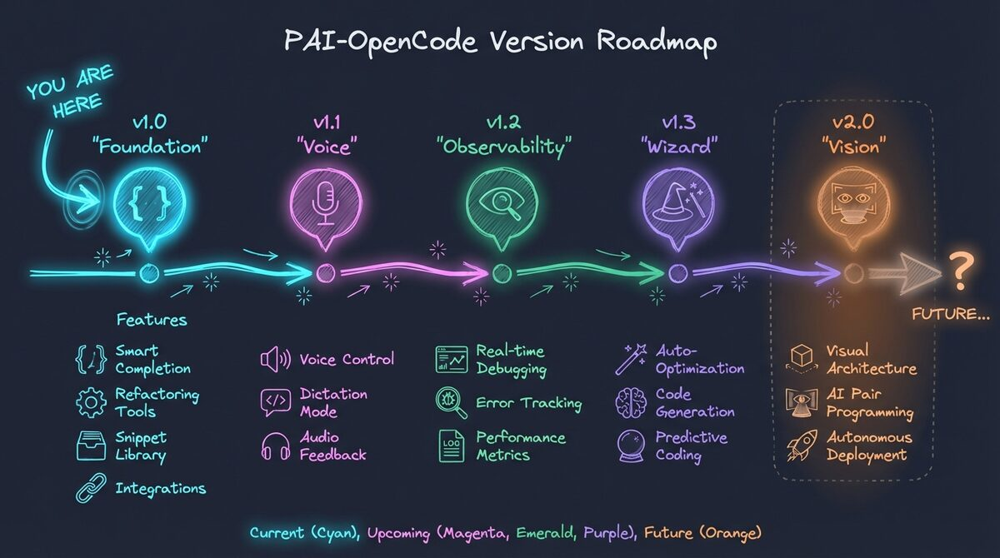
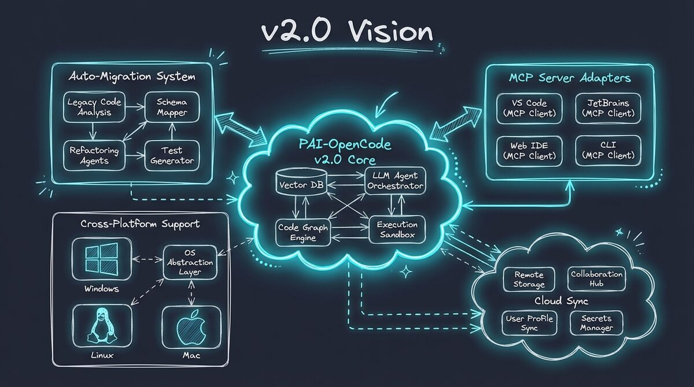

# PAI-OpenCode Roadmap

This roadmap outlines the development path from v1.0 to v2.0 and beyond.

## Current Release

### v1.3.0 - Multi-Provider Agent System (February 2026)

**Status:** ✅ Released

**Major Feature:** 16 specialized agents with model tier routing and 3 provider presets

**What's New in v1.3:**
- **16 Agents** - Expanded from ~11 to 16 specialized agents
- **Model Tiers** - `quick`/`standard`/`advanced` routing per agent via `opencode.json`
- **3 Presets** - Anthropic Max, ZEN PAID, ZEN FREE (replaces 8 provider system)
- **Rewritten Wizard** - Prerequisites → Dev build → 3 presets → Identity → Config
- **Researcher Renames** - `ClaudeResearcher` → `DeepResearcher`, `PerplexityProResearcher` removed
- **Profile YAML** - New format: `default_model:` + `agents:` with optional `tiers:`
- **Git Cleanup** - `MEMORY/` excluded from git, `.gitkeep` preserves structure

**Technical Details:**
- 16 agents with tier-based routing
- PR #11377 enables `model_tiers` support (requires dev build)
- Simplified provider configuration (3 presets vs 8 providers)
- Backwards-compatible wizard flow

**Documentation:**
- [CHANGELOG.md](CHANGELOG.md) - Full release notes
- [README.md](README.md) - Updated for v1.3
- [docs/ADVANCED-SETUP.md](docs/ADVANCED-SETUP.md) - Model tier configuration

---

## Previous Releases

### v1.1.0 - PAI 2.5 + Voice/Sentiment Handlers (February 2026)

**Status:** ✅ Released

**Major Upgrade:** Full PAI 2.5 Algorithm + 5 new handlers

**What's New in v1.1:**
- **PAI 2.5 Algorithm** (v0.2.25) - Full 7-phase format with ISC tracking
- **Voice Notification Handler** - ElevenLabs + Google TTS + macOS say fallback
- **Implicit Sentiment Handler** - Automatic satisfaction detection from user messages
- **Tab State Handler** - Kitty terminal tab title/color updates
- **Update Counts Handler** - Skill/workflow counting at session end
- **Response Capture Handler** - ISC extraction and learning capture

**Technical Details:**
- 13 handlers total (up from 8 in v1.0)
- Build: 21 modules, 85.77 KB
- Graceful fallbacks for all optional features

---

### v1.0.0 - Core PAI on OpenCode (January 2026)

**Status:** ✅ Released

**What's Included:**
- Skills system with 29 skills (CORE, Algorithm, Fabric, Research, etc.)
- Plugin system (security validator, context loader)
- Memory system (projects, sessions, learning)
- Agent system (14 agents, PascalCase naming)
- Skill search and indexing tools
- Full TypeScript tooling with Bun runtime

**Documentation:**
- [README.md](README.md) - Project overview
- [INSTALL.md](INSTALL.md) - Installation guide
- [CONTRIBUTING.md](CONTRIBUTING.md) - Contribution guidelines

---

## Upcoming Releases

---

### v1.5.0 - Enhanced Setup & Health Monitoring (Q2 2026)

**Goal:** Advanced setup options and system health

**Features:**
- ✅ Installation Wizard (shipped in v1.3)
- Skill selection UI (enable/disable individual skills)
- System health checks and diagnostics
- Configuration validation
- Migration assistant from Claude Code PAI (interactive)

---

## Future Vision

### v2.0.0 - Full PAI Parity & Auto-Migration (Q3 2026)

**Goal:** Complete feature parity with PAI 2.4 + seamless migration

**Major Features:**

1. **Auto-Migration System**
   - One-command migration from PAI 2.4
   - Skill mapping and compatibility layer
   - Memory import (sessions, projects, learning)

2. **Advanced Skill Orchestration**
   - Skill dependencies and auto-loading
   - Parallel skill execution
   - Community skill marketplace

3. **Enhanced Security**
   - Sandboxed skill execution
   - Granular permission system
   - Audit logging

4. **MCP Server Adapters**
   - deepwiki-enhanced (GitHub repo Q&A via Devin API)
   - Community MCP server integrations

---

## How to Influence the Roadmap

We value community input! Here's how to shape PAI-OpenCode's future:

1. **Vote on Features**: Comment on [roadmap issues](https://github.com/Steffen025/pai-opencode/labels/roadmap)
2. **Propose Ideas**: Open a [discussion](https://github.com/Steffen025/pai-opencode/discussions)
3. **Contribute Code**: Tackle items from the roadmap ([CONTRIBUTING.md](CONTRIBUTING.md))
4. **Share Use Cases**: Tell us how you use PAI-OpenCode

---

## Version History

| Version | Release Date | Highlights |
|---------|-------------|------------|
| v1.3.0  | February 2026 | Multi-Provider Agent System with Model Tiers |
| v1.2.0  | February 2026 | Observability Dashboard + 14 handlers |
| v1.1.0  | February 2026 | PAI 2.5 upgrade + Voice/Sentiment handlers |
| v1.0.1  | February 2026 | Anthropic API fix, ISCValidator improvements |
| v1.0.0  | January 2026 | Initial release - core PAI on OpenCode |

---

**Stay Updated:**
- Watch this repo for releases
- Follow [Discussions](https://github.com/Steffen025/pai-opencode/discussions) for announcements
