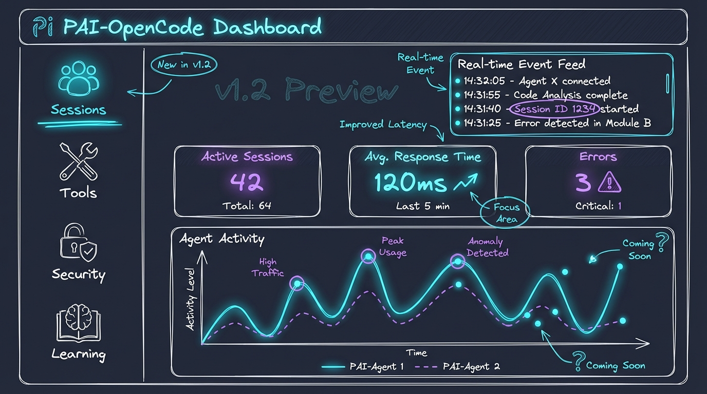

# PAI-OpenCode Roadmap

This roadmap outlines the development path from v1.0 to v2.0 and beyond.

## Current Release

### v1.0.0 - Core PAI on OpenCode (January 2026)

**Status:** Released

**What's Included:**
- Skills system with 20+ skills (CORE, Algorithm, Fabric, Research, etc.)
- Plugin system (security validator, context loader)
- Memory system (projects, sessions, learning)
- Agent system (13 agents, PascalCase naming)
- Skill search and indexing tools
- Full TypeScript tooling with Bun runtime

**What Works:**
- Complete skill loading and orchestration
- Security validation for dangerous commands
- Session lifecycle management
- Multi-phase development workflows (SpecFirst)
- Agent composition (RedTeam, Council, Challenge)
- Visual content generation (Art skill)

**Documentation:**
- [README.md](README.md) - Project overview
- [INSTALL.md](INSTALL.md) - Installation guide
- [CONTRIBUTING.md](CONTRIBUTING.md) - Contribution guidelines

---

## Upcoming Releases

### v1.1.0 - Voice Notifications (Q1 2026)

**Goal:** Add audio feedback for key events

**Features:**
- Voice server with TTS support
- Task completion notifications
- Error/warning audio alerts
- Session start/stop announcements
- Volume control and mute toggle

**Technical Approach:**
- Bun HTTP server for voice synthesis
- Plugin integration for event triggers
- macOS `say` command support

---

### v1.2.0 - Observability Dashboard (Q2 2026)

**Goal:** Visual monitoring of PAI activity

**Features:**
- Real-time event stream visualization
- Skill usage analytics
- Plugin execution timeline
- Session history browser
- Export capabilities (JSON, CSV)

**Technical Stack:**
- Vue 3 frontend
- Bun HTTP server backend
- SQLite for event storage
- Server-Sent Events (SSE) for real-time updates

---

### v1.3.0 - Installation Wizard (Q2 2026)

**Goal:** Interactive setup for new users

**Features:**
- Guided CLI wizard for first-time setup
- API provider configuration
- Skill selection (enable/disable)
- Validation and health checks
- Optional migration from Claude Code PAI

---

## Future Vision

### v2.0.0 - Full PAI Parity & Auto-Migration (Q3 2026)

**Goal:** Complete feature parity with PAI 2.3 + seamless migration

**Major Features:**

1. **Auto-Migration System**
   - One-command migration from PAI 2.3
   - Skill mapping and compatibility layer
   - Memory import (sessions, projects, learning)

2. **Advanced Skill Orchestration**
   - Skill dependencies and auto-loading
   - Parallel skill execution
   - Community skill marketplace

3. **Enhanced Security**
   - Sandboxed skill execution
   - Granular permission system
   - Audit logging

4. **MCP Server Adapters**
   - deepwiki-enhanced (GitHub repo Q&A via Devin API)
   - Community MCP server integrations

---

## How to Influence the Roadmap

We value community input! Here's how to shape PAI-OpenCode's future:

1. **Vote on Features**: Comment on [roadmap issues](https://github.com/Steffen025/pai-opencode/labels/roadmap)
2. **Propose Ideas**: Open a [discussion](https://github.com/Steffen025/pai-opencode/discussions)
3. **Contribute Code**: Tackle items from the roadmap ([CONTRIBUTING.md](CONTRIBUTING.md))
4. **Share Use Cases**: Tell us how you use PAI-OpenCode

---

## Version History

| Version | Release Date | Highlights |
|---------|-------------|------------|
| v1.0.0  | January 2026 | Initial release - core PAI on OpenCode |

---

**Stay Updated:**
- Watch this repo for releases
- Follow [Discussions](https://github.com/Steffen025/pai-opencode/discussions) for announcements
