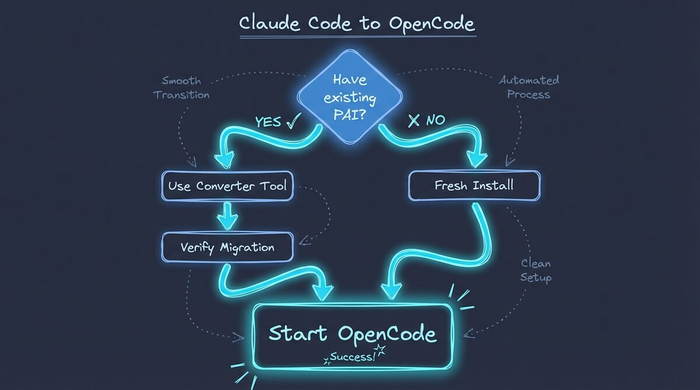

# Migration Guide

**Migrating from Claude Code PAI to PAI-OpenCode**

---

## Overview

This guide helps you migrate an existing PAI 2.x installation from Claude Code to OpenCode.

**Two migration paths:**

1. **Fresh Install** - Start clean with PAI-OpenCode defaults
2. **Migration** - Transfer your customizations from Claude Code PAI



---

## Prerequisites

### Required

- **Bun** (JavaScript runtime)
  ```bash
  curl -fsSL https://bun.sh/install | bash
  ```

- **OpenCode** (AI coding assistant)
   ```bash
   # For v1.3+ features (model tiers, agent routing), build from source:
   # See INSTALL.md for detailed build instructions
   go install github.com/anomalyco/opencode@latest
   ```
   > **Note:** v1.3.0 features (model tiers, agent-specific routing) require a dev build from source. See [INSTALL.md](../INSTALL.md) for build instructions.

---

## Path 1: Fresh Install (Recommended for New Users)

```bash
# 1. Clone repository
git clone https://github.com/Steffen025/pai-opencode.git
cd pai-opencode

# 2. Install dependencies
bun install

# 3. Start OpenCode
opencode
```

**That's it!** PAI is now running with defaults.

---

## Path 2: Migration from Claude Code PAI

### Step 1: Verify Source PAI

Check your Claude Code PAI installation:

```bash
ls -la ~/.claude/

# Expected structure:
# ~/.claude/
# ├── skills/
# ├── agents/
# ├── hooks/
# ├── MEMORY/
# └── settings.json
```

### Step 2: Clone PAI-OpenCode

```bash
git clone https://github.com/Steffen025/pai-opencode.git
cd pai-opencode
```

### Step 3: Preview Migration (Dry Run)

```bash
bun Tools/pai-to-opencode-converter.ts \
  --source ~/.claude \
  --target .opencode \
  --dry-run
```

**Review the output:**
- What will be copied
- What will be transformed
- What requires manual work

### Step 4: Run Migration

```bash
bun Tools/pai-to-opencode-converter.ts \
  --source ~/.claude \
  --target .opencode
```

### Step 5: Verify Migration

```bash
# Check structure
ls -la .opencode/

# Verify no .claude references
grep -r "\.claude" .opencode/ --exclude-dir=node_modules
```

### Step 6: Test OpenCode

```bash
opencode
```

**Verify:**

1. **Skills load:** "What skills do I have?"
2. **Agents work:** `@Intern hello`
3. **Security active:** Check `/tmp/pai-opencode-debug.log`

---

## Architecture Changes

PAI-OpenCode required several architectural adaptations to work with OpenCode. These are documented in Architecture Decision Records (ADRs):

| Change | ADR | Impact |
|--------|-----|--------|
| Hooks → Plugins | [ADR-001](architecture/adr/ADR-001-hooks-to-plugins-architecture.md) | Implementation only—logic preserved |
| `.claude/` → `.opencode/` | [ADR-002](architecture/adr/ADR-002-directory-structure-claude-to-opencode.md) | Path updates only |
| File-based logging | [ADR-004](architecture/adr/ADR-004-plugin-logging-file-based.md) | Debug workflow change |
| Dual config files | [ADR-005](architecture/adr/ADR-005-configuration-dual-file-approach.md) | settings.json + opencode.json |

**What stayed the same:**
- Skills System: [ADR-003](architecture/adr/ADR-003-skills-system-unchanged.md) - 100% identical
- Security: [ADR-006](architecture/adr/ADR-006-security-validation-preservation.md) - Patterns preserved
- Memory: [ADR-007](architecture/adr/ADR-007-memory-system-structure-preserved.md) - Structure unchanged

---

## What Transfers

| Component | Transfer Status | Notes |
|-----------|----------------|-------|
| **Skills** | ✅ Full transfer | All skills work identically |
| **Agents** | ✅ Full transfer | Renamed to PascalCase |

**v1.3 Agent Changes:**
- `ClaudeResearcher` → `DeepResearcher`
- `PerplexityProResearcher` removed (use `PerplexityResearcher`)
- `researcher.md` renamed to individual researcher files
| **MEMORY** | ✅ Full transfer | Work, Learning, State preserved |
| **Security Patterns** | ✅ Full transfer | `patterns.yaml` copied |
| **USER Customizations** | ✅ Full transfer | TELOS, ABOUTME, etc. |
| **settings.json** | ⚠️ Partial transfer | Schema mapped |
| **Hooks** | ❌ Manual work | Convert to plugins |
| **MCP Servers** | ❌ Deferred | v1.x feature |
| **Observability** | ❌ Deferred | v1.2 feature |

---

## What Doesn't Transfer (Manual Work Required)

### Custom Hooks

If you have custom hooks in `~/.claude/hooks/`:

1. **Extract logic** from hook file
2. **Create handler** in `.opencode/plugins/handlers/`
3. **Add event** to `.opencode/plugins/pai-unified.ts`

**Example:**

```typescript
// Old hook: ~/.claude/hooks/custom-logger.ts
writeFileSync("/tmp/my-log.txt", "Tool executed");
process.exit(0);

// New plugin handler: .opencode/plugins/handlers/custom-logger.ts
import { fileLog } from "../lib/file-logger";
export async function customLog() {
  fileLog("Tool executed");
}
```

See **PLUGIN-SYSTEM.md** for full guide.

---

## Troubleshooting

### "opencode: command not found"

```bash
export PATH="$PATH:$(go env GOPATH)/bin"
```

### Plugin doesn't load

```bash
cat /tmp/pai-opencode-debug.log
# Should show: "PAI-OpenCode Plugin Loaded"
```

### Agent invocation fails

Verify agent files are PascalCase:
```bash
ls -la .opencode/agents/
# Should be: Intern.md (not intern.md)
```

### CORE skill not loading

```bash
grep "Context" /tmp/pai-opencode-debug.log
# Should show: "Context injected successfully"
```

### TUI corruption

```bash
reset && opencode
```

Check plugin code for `console.log` (should use `fileLog`).

---

## Converter Tool Reference

### Usage

```bash
bun Tools/pai-to-opencode-converter.ts [options]
```

### Options

| Option | Description | Default |
|--------|-------------|---------|
| `--source <path>` | Source PAI directory | `~/.claude` |
| `--target <path>` | Target OpenCode directory | `.opencode` |
| `--mode <mode>` | Migration mode (`full` or `selective`) | `full` |
| `--dry-run` | Preview changes without applying | `false` |

### Migration Modes Explained

#### Full Mode (Default)

Copies **everything** from your Claude Code PAI:

```bash
bun Tools/pai-to-opencode-converter.ts --mode full
```

| What Gets Copied | Description |
|-----------------|-------------|
| Skills | All skill definitions |
| Agents | All agent personalities |
| MEMORY | Projects, sessions, learning history |
| USER | TELOS, identity, preferences |
| Security patterns | Custom security rules |
| Settings | Environment variables |

**Best for:** Starting fresh with your complete PAI history.

#### Selective Mode

Copies only **system components**, preserving your existing USER customizations:

```bash
bun Tools/pai-to-opencode-converter.ts --mode selective
```

| What Gets Copied | What's Preserved |
|-----------------|------------------|
| Skills (system) | USER/TELOS.md |
| Agents (system) | USER/ABOUTME.md |
| Security patterns | USER/Contacts.md |
| Settings (schema only) | Custom USER files |

**Best for:**
- Updating to a new PAI-OpenCode version
- Preserving personal customizations while getting new skills
- Merging multiple PAI installations

### Examples

**Preview full migration (dry run):**
```bash
bun Tools/pai-to-opencode-converter.ts --dry-run
```

**Full migration:**
```bash
bun Tools/pai-to-opencode-converter.ts --mode full
```

**Selective migration (preserve USER customizations):**
```bash
bun Tools/pai-to-opencode-converter.ts --mode selective
```

**Custom source and target:**
```bash
bun Tools/pai-to-opencode-converter.ts \
  --source ~/backup/.claude \
  --target .opencode \
  --mode selective
```

---

## Post-Migration Checklist

After migration, verify:

- [ ] OpenCode starts without errors
- [ ] CORE skill loads (check first response)
- [ ] Agents work (`@Intern hello`)
- [ ] Security blocks dangerous commands
- [ ] MEMORY preserved (check `.opencode/MEMORY/`)
- [ ] USER customizations intact (check `.opencode/USER/`)
- [ ] Debug log shows plugin loaded

---

## Rollback

If migration fails:

```bash
# Delete failed migration
rm -rf .opencode/

# Re-clone fresh
git clone https://github.com/Steffen025/pai-opencode.git
```

Your original PAI (Claude Code) is **never modified** during migration.

---

## Getting Help

- **[PAI-to-OpenCode Mapping Guide](../.opencode/PAISYSTEM/PAI-TO-OPENCODE-MAPPING.md)** - Component mapping rules and common errors
- **PLUGIN-SYSTEM.md** - Plugin development
- **PAI-ADAPTATIONS.md** - What changed from PAI 2.4
- **GitHub Issues**: https://github.com/Steffen025/pai-opencode/issues

---

## Next Steps

After successful migration:

1. **Customize** - Edit `.opencode/settings.json`
2. **Explore** - Try all skills and agents
3. **Secure** - Review `.opencode/PAISECURITYSYSTEM/patterns.yaml`
4. **Learn** - Read skill documentation in `.opencode/skills/*/SKILL.md`

### Migrating from pre-v1.3

If migrating from a pre-v1.3 installation:

```bash
# Re-run the wizard to update provider profiles and agent model routing
bun run .opencode/PAIOpenCodeWizard.ts
```

This will update your `opencode.json` with:
- New provider preset system (3 presets instead of 8 providers)
- Agent-specific model tier routing (quick/standard/advanced)
- 16 agents with updated researcher mappings

---

**PAI-OpenCode v1.0** - Your PAI, Your Way
