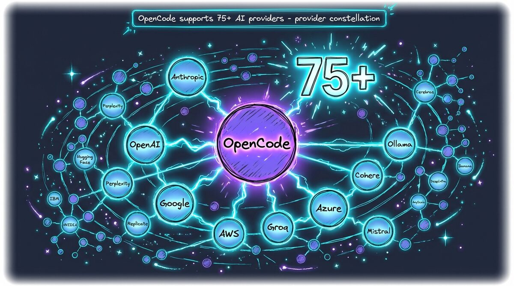
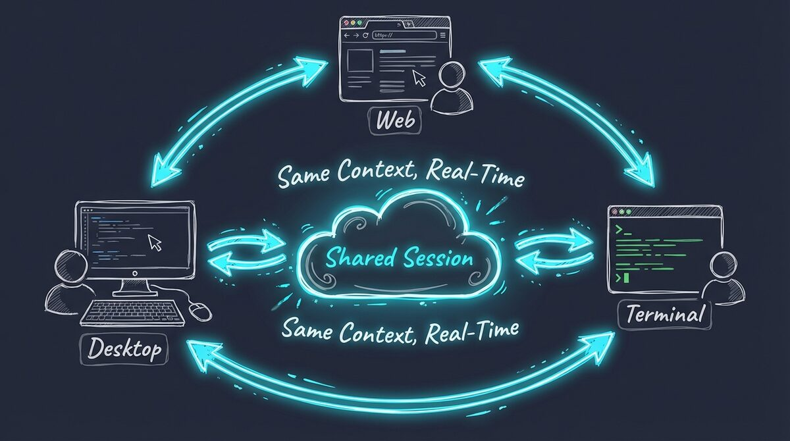
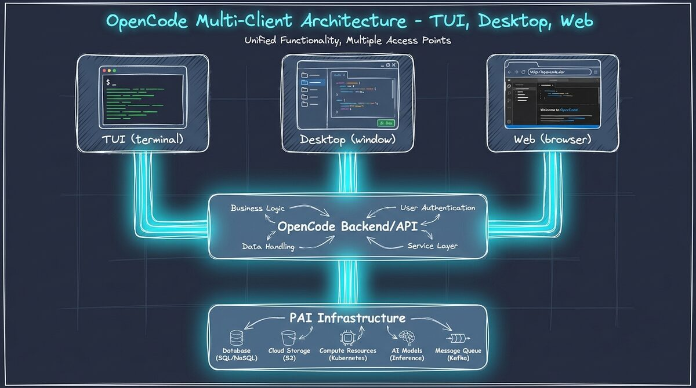

# OpenCode: Unique Features

OpenCode is an open-source AI coding assistant built by Anomaly. While many AI coding tools exist, OpenCode has distinctive features that make it particularly well-suited for PAI (Personal AI Infrastructure).

## 1. Provider Flexibility (75+ AI Providers)

Unlike tools locked to a single vendor, OpenCode supports **75+ AI providers** out of the box. But v1.3.0 goes further — you don't just switch providers for the whole session, the orchestrator routes **each agent to different providers within the same session**.

### Supported Providers (Highlights)

| Category | Providers |
|----------|-----------|
| **Enterprise** | Anthropic (Claude), OpenAI (GPT-4), Google (Gemini), AWS Bedrock, Azure OpenAI |
| **Speed-Optimized** | Groq, Together.ai, Fireworks, DeepSeek |
| **Open Source** | Mistral, Cohere, Perplexity, Meta (Llama) |
| **Local** | Ollama, LM Studio, vLLM, LocalAI |

**Why this matters for PAI:**
PAI is model-agnostic. You can run the same skills, agents, and workflows on Claude Opus, GPT-4, or a local Llama model. OpenCode makes this seamless — and v1.3.0 adds dynamic per-agent routing.



### Dynamic Agent Routing (v1.3.0)

This is the key differentiator: **agents don't just have different models, they dynamically scale up and down based on task complexity**.

| Agent | Default | Scales Down To | Scales Up To |
|-------|---------|----------------|--------------|
| **Architect** | Kimi K2.5 | GLM 4.7 (quick review) | Claude Opus 4.6 (complex architecture) |
| **Engineer** | Kimi K2.5 | GLM 4.7 (batch edits) | Claude Sonnet 4.5 (complex debugging) |
| **DeepResearcher** | GLM 4.7 | MiniMax (quick lookup) | Kimi K2.5 (deep analysis) |
| **Writer** | Gemini 3 Flash | MiniMax (quick drafts) | Claude Sonnet 4.5 (premium copy) |
| **Pentester** | Kimi K2.5 | GLM 4.7 (quick scan) | Claude Sonnet 4.5 (deep audit) |

**How it works:**
1. You (or the orchestrator) spawn an agent with a task
2. The orchestrator assesses complexity: quick, standard, or advanced
3. The agent routes to the appropriate model tier via `model_tier` parameter
4. Same agent, different model — you pay exactly what the task requires

**Example:**
```typescript
// Simple batch work → cheapest model
Task({ subagent_type: "Engineer", model_tier: "quick", prompt: "Replace X with Y in 20 files" })
// Routes to GLM 4.7

// Complex debugging → premium model  
Task({ subagent_type: "Engineer", model_tier: "advanced", prompt: "Debug this race condition" })
// Routes to Claude Sonnet 4.5
```

This is unique to OpenCode. Claude Code cannot do this — it's locked to Anthropic only.

### Legacy: Session-Level Provider Switching

For switching the entire session provider (v1.0 behavior):

```bash
# Use Claude Opus for everything
opencode --provider anthropic --model claude-opus-4-5

# Use Groq for blazing-fast iterations
opencode --provider groq --model llama-3.3-70b-versatile

# Use local Ollama for offline work
opencode --provider ollama --model qwen2.5-coder:32b
```

Same PAI infrastructure, different provider strategy.

## 2. Session Sharing (Real-Time Collaboration)

OpenCode pioneered **live session sharing**—multiple users can join the same AI coding session in real-time.

### How It Works

1. **Start a session** with OpenCode
2. **Share the session URL** (e.g., `opencode.dev/session/abc123`)
3. **Collaborators join** via browser, desktop, or terminal
4. **Everyone sees the same context**, messages, and code changes live



### Use Cases

- **Pair Programming**: Navigate complex refactors together
- **Code Review**: Review AI-generated code with teammates in real-time
- **Teaching**: Instructor shares session, students watch AI solve problems
- **Async Handoffs**: Share session link for context-rich handoffs

**PAI Integration:**
Share sessions with full PAI context. Your skills, agents, and memory are visible to collaborators—perfect for team environments using shared PAI configurations.

## 3. Plugin System (Extensibility)

OpenCode has a **plugin architecture** for extending functionality without modifying core code.

### Hooks vs Plugins

| Feature | PAI Hooks (Claude Code) | OpenCode Plugins |
|---------|-------------------------|------------------|
| **Scope** | PAI-specific lifecycle | OpenCode core functionality |
| **Language** | TypeScript | TypeScript/JavaScript |
| **Purpose** | AI behavior, memory, security | UI, integrations, providers |

**Example plugins:**
- Custom AI provider integration
- Enhanced terminal UI widgets
- External tool integrations (Jira, Linear, Notion)

PAI plugins control **what the AI does**. OpenCode plugins control **how the tool works**.

## 4. Multi-Client Architecture

OpenCode runs on **three clients** sharing the same backend:

### Terminal UI (TUI)
- Primary interface for developers
- Full keyboard shortcuts
- Vim/Emacs keybindings
- Optimized for SSH/remote work

### Desktop App
- Electron-based native app
- macOS, Windows, Linux
- System tray integration

### Web Interface
- Browser-based access
- No installation required
- Perfect for session sharing
- Mobile-friendly



**PAI Compatibility:**
All PAI features (skills, agents, plugins) work identically across all three clients. Switch between terminal and browser mid-session without losing context.

## 5. Themes (15+ Built-In)

OpenCode ships with **15+ carefully designed themes** for the terminal UI:

- **Catppuccin** (Latte, Frappé, Macchiato, Mocha)
- **Dracula**
- **Nord**
- **Solarized** (Dark, Light)
- **Gruvbox**
- **One Dark Pro**
- **Tokyo Night**
- And more...

```bash
# Set theme via config
opencode config set theme "catppuccin-mocha"

# Or via flag
opencode --theme nord
```

## 6. CLI Mode (Scripting & Automation)

Beyond interactive mode, OpenCode has a **CLI mode** for scripting:

```bash
# Run a single prompt and exit
opencode run "Analyze this codebase for security vulnerabilities"

# Pipe input
cat requirements.txt | opencode run "Generate test cases"

# Output to file
opencode run "Document all API endpoints" > docs/API.md

# Use in CI/CD
opencode run "Review this PR for breaking changes" --context pr-diff.txt
```

**PAI Use Case:**
Trigger PAI skills from shell scripts, cron jobs, or git hooks:

```bash
# Daily security scan
opencode run "/security --scan-all" >> reports/$(date +%Y-%m-%d).log

# Pre-commit hook
opencode run "Check for secrets in staged files"
```

## Comparison: OpenCode vs Alternatives

| Feature | OpenCode | Cursor | Copilot | Claude Code |
|---------|----------|--------|---------|-------------|
| **Provider choice** | 75+ | OpenAI only | GitHub Models | Anthropic only |
| **Session sharing** | ✅ Yes | ❌ No | ❌ No | ❌ No |
| **Multi-client** | TUI + Desktop + Web | Desktop only | VS Code only | Desktop only |
| **Plugin system** | ✅ Yes | Limited | GitHub extensions | Hooks only |
| **Open source** | ✅ Fully | ❌ Proprietary | ❌ Proprietary | ❌ Proprietary |
| **PAI compatible** | ✅ Native support | ⚠️ Limited | ⚠️ Limited | ✅ Original |

## Why OpenCode + PAI?

OpenCode's **provider flexibility** + **plugin system** + **multi-client architecture** + **dynamic agent routing** make it uniquely suited for PAI:

1. **Freedom**: Run PAI skills on any model (Claude, GPT-4, local)
2. **Dynamic Routing**: Each agent scales to the right model per task — something Claude Code cannot do
3. **Collaboration**: Share PAI-enhanced sessions with teammates
4. **Consistency**: Same PAI experience across terminal, desktop, browser
5. **Extensibility**: Plugins = unlimited customization

OpenCode provides the **platform**. PAI provides the **personalization**. Dynamic tier routing provides the **cost optimization**.

## Learn More

- **Official OpenCode Docs**: [docs.opencode.ai](https://docs.opencode.ai)
- **GitHub Repository**: [github.com/anomalyco/opencode](https://github.com/anomalyco/opencode)

---

**Next Steps:**
- [Install PAI-OpenCode](../INSTALL.md)
- [Understand the Plugin System](./PLUGIN-SYSTEM.md)
- [Migration from Claude Code](./MIGRATION.md)
