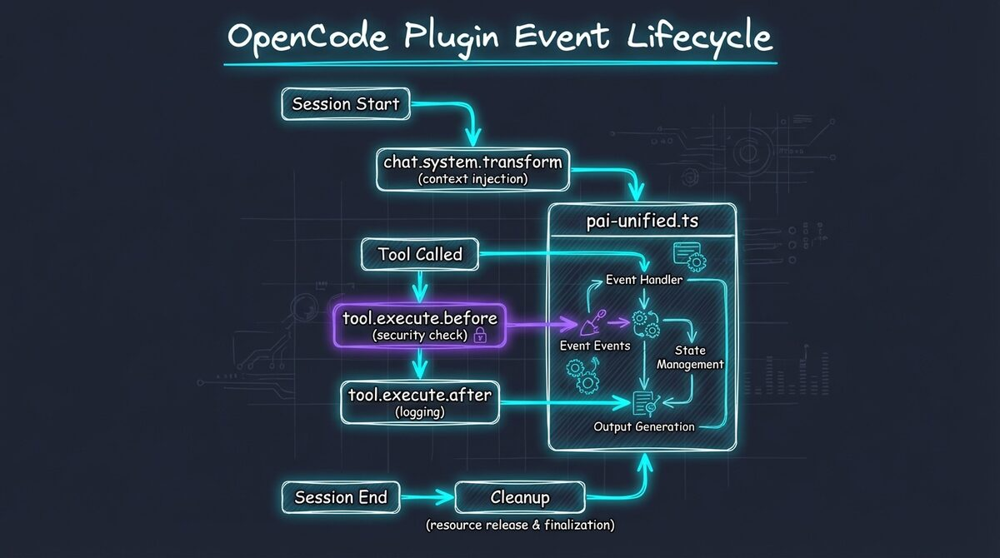
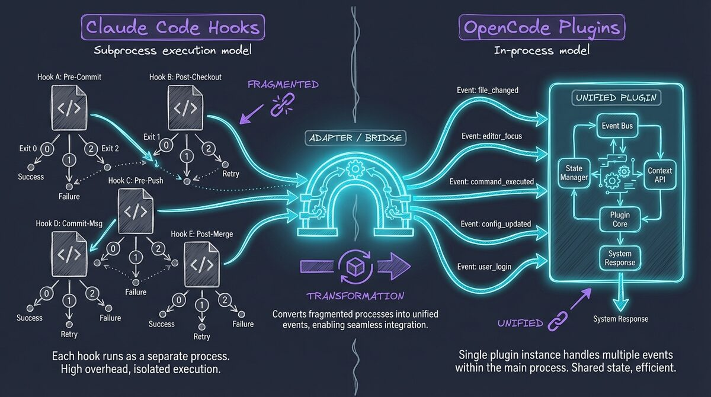

# OpenCode Plugin System

**How PAI-OpenCode implements the Personal AI Infrastructure using OpenCode's plugin architecture**

---

## Overview

> **Architecture Decision:** [ADR-001 - Hooks → Plugins Architecture](architecture/adr/ADR-001-hooks-to-plugins-architecture.md)

OpenCode uses a **plugin system** to extend functionality, while Claude Code uses **hooks**. Both achieve the same goals—context injection, security validation, lifecycle management—but with different implementation patterns.

PAI-OpenCode implements all PAI functionality in a **single unified plugin** (`plugins/pai-unified.ts`) that handles multiple lifecycle events.



---

## Hooks vs Plugins: The Translation

| Aspect | Claude Code (Hooks) | OpenCode (Plugins) |
|--------|---------------------|-------------------|
| **Architecture** | Multiple separate hook files | Single unified plugin file |
| **Execution** | Subprocess (Bun + exit codes) | In-process (TypeScript function) |
| **Blocking** | `exit(2)` blocks execution | `throw Error()` blocks execution |
| **Communication** | JSON via stdout | Direct function return |
| **Configuration** | `.claude/hooks/` directory | `opencode.json` plugins array |
| **Logging** | stdout/stderr | File logging (`/tmp/pai-opencode-debug.log`) |



---

## Event Lifecycle

OpenCode plugins subscribe to **events** (lifecycle hooks). The PAI unified plugin uses these:

### 1. Context Injection
**Event:** `experimental.chat.system.transform`
**Purpose:** Inject CORE skill context at session start
**Equivalent to:** `load-core-context.ts` hook

```typescript
"experimental.chat.system.transform": async (input, output) => {
  const result = await loadContext();
  if (result.success && result.context) {
    output.system.push(result.context);
  }
}
```

**What it does:**
- Reads `skills/CORE/SKILL.md`
- Loads system documentation (`SYSTEM/*.md`)
- Loads user context (`USER/TELOS/*.md`)
- Injects combined context into chat system

---

### 2. Security Validation
**Event:** `tool.execute.before`
**Purpose:** Block dangerous commands before execution
**Equivalent to:** `security-validator.ts` hook

```typescript
"tool.execute.before": async (input, output) => {
  const result = await validateSecurity({
    tool: input.tool,
    args: output.args
  });

  if (result.action === "block") {
    throw new Error(`[PAI Security] ${result.reason}`);
  }
}
```

**Blocking behavior:**
- `throw Error()` → Command blocked (hard stop)
- Return normally → Command allowed

---

### 3. Post-Execution Tracking
**Event:** `tool.execute.after`
**Purpose:** Capture tool execution for learning and observability

```typescript
"tool.execute.after": async (input, output) => {
  fileLog(`Tool completed: ${input.tool}`);
  // Future: Learning capture, event logging
}
```

---

## Creating a Custom Plugin

### 1. Plugin Structure

```typescript
import type { Plugin, Hooks } from "@opencode-ai/plugin";

export const MyPlugin: Plugin = async (ctx) => {
  const hooks: Hooks = {
    // Event handlers here
  };

  return hooks;
};

export default MyPlugin;
```

### 2. Available Events

| Event | When Triggered | Use For |
|-------|----------------|---------|
| `experimental.chat.system.transform` | Session start | Context injection |
| `tool.execute.before` | Before tool runs | Validation, blocking |
| `tool.execute.after` | After tool runs | Logging, learning |
| `chat.message` | User/assistant message | Message processing |
| `event` | Session lifecycle | Session management |

### 3. File Logging (Critical)

> **Architecture Decision:** [ADR-004 - Plugin Logging (File-Based)](architecture/adr/ADR-004-plugin-logging-file-based.md)

**NEVER use `console.log()` in plugins!** It corrupts the TUI.

```typescript
import { fileLog, fileLogError } from "./lib/file-logger";

fileLog("Normal message");
fileLog("Warning message", "warn");
fileLog("Error message", "error");
fileLogError("Error with stack trace", error);
```

Logs appear in: `/tmp/pai-opencode-debug.log`

### 4. Configuration

Add to `opencode.json`:

```json
{
  "plugins": [
    ".opencode/plugins/pai-unified.ts",
    ".opencode/plugins/my-custom-plugin.ts"
  ]
}
```

---

## Security Considerations

### 1. Fail-Open Philosophy

Plugins should **fail-open** for usability:

```typescript
try {
  const result = await validateSecurity(input);
  if (result.action === "block") {
    throw new Error("Blocked");
  }
} catch (error) {
  // Log error but don't block on plugin failure
  fileLogError("Validation failed", error);
  // Continue execution
}
```

**Exception:** Security validation should fail-closed (block on error) when validating commands.

### 2. Input Validation

Always validate input before processing:

```typescript
const tool = input.tool || "unknown";
const args = output.args ?? {};  // Args are in OUTPUT, not input!

if (!tool || typeof tool !== "string") {
  fileLog("Invalid tool input", "warn");
  return;
}
```

---

## OpenCode API Quirks

### 1. Args in Output, Not Input

**Quirk:** Tool arguments are in `output.args`, not `input.args`.

```typescript
"tool.execute.before": async (input, output) => {
  // WRONG: input.args (doesn't exist)
  // RIGHT: output.args
  const command = output.args?.command;
}
```

### 2. Experimental Hooks

Some hooks are marked `experimental.*` and may change:

- `experimental.chat.system.transform` (context injection)

Always check OpenCode release notes when updating.

---

## Plugin Development Workflow

### 1. Development Setup

```bash
# Start OpenCode
opencode

# Tail the debug log in another terminal
tail -f /tmp/pai-opencode-debug.log
```

### 2. Testing Changes

OpenCode reloads plugins on each session start:

1. Edit plugin file
2. Exit OpenCode (`Ctrl+C`)
3. Restart OpenCode
4. Check debug log for errors

### 3. Debugging

```typescript
// Add debug logging
fileLog(`DEBUG: input = ${JSON.stringify(input)}`, "debug");
fileLog(`DEBUG: output = ${JSON.stringify(output)}`, "debug");
```

Check `/tmp/pai-opencode-debug.log`:

```bash
cat /tmp/pai-opencode-debug.log | grep DEBUG
```

---

## Unified Plugin Architecture

PAI-OpenCode uses **one plugin** for all functionality with **14 handlers**:

```
plugins/
├── pai-unified.ts              # Main plugin (exports all hooks)
├── handlers/
│   ├── context-loader.ts       # Context injection at session start
│   ├── security-validator.ts   # Security validation before commands
│   ├── rating-capture.ts       # User rating capture (1-10)
│   ├── isc-validator.ts        # ISC criteria validation
│   ├── learning-capture.ts     # Learning to MEMORY/LEARNING/
│   ├── work-tracker.ts         # Work session tracking
│   ├── skill-restore.ts        # Skill context restore
│   ├── agent-capture.ts        # Agent output capture
│   ├── voice-notification.ts   # TTS (ElevenLabs/Google/macOS) [v1.1]
│   ├── implicit-sentiment.ts   # Sentiment detection [v1.1]
│   ├── tab-state.ts            # Kitty terminal tab updates [v1.1]
│   ├── update-counts.ts        # Skill/workflow counting [v1.1]
│   └── response-capture.ts     # ISC tracking + learning [v1.1]
│   ├── observability-emitter.ts  # Fire-and-forget event emission to observability server [v1.2]
├── adapters/
│   └── types.ts                # Shared type definitions
└── lib/
    ├── file-logger.ts          # Logging utilities
    ├── paths.ts                # Path resolution
    ├── identity.ts             # User/AI identity
    ├── time.ts                 # Timestamp utilities [v1.1]
    ├── model-config.ts         # Model configuration
    └── learning-utils.ts       # Learning capture helpers
```

**Why unified?**
- Single configuration point
- Shared state between handlers
- Simpler plugin management
- Easier to reason about execution order

### Handler Categories

| Category | Handlers | Purpose |
|----------|----------|---------|
| **Core** | context-loader, security-validator | Essential session management |
| **Learning** | rating-capture, learning-capture, isc-validator | Quality feedback loops |
| **Observability** | work-tracker, agent-capture, response-capture | Session tracking |
| **UX** | voice-notification, tab-state, implicit-sentiment | User experience |
| **Observability** | observability-emitter | Event emission to external systems |
| **Maintenance** | skill-restore, update-counts | System upkeep |

---

## Migration from Hooks

If you have custom Claude Code hooks:

| Hook File | Plugin Event | Handler |
|-----------|--------------|---------|
| `load-core-context.ts` | `experimental.chat.system.transform` | `context-loader.ts` |
| `security-validator.ts` | `tool.execute.before` | `security-validator.ts` |
| `initialize-session.ts` | `event` (session.created) | Event handler |
| `stop-hook.ts` | `event` (session.ended) | Event handler |

**Process:**
1. Extract logic from hook file
2. Create handler in `plugins/handlers/`
3. Add event subscription to `pai-unified.ts`
4. Convert exit codes to throw/return
5. Replace console.log with fileLog

See **MIGRATION.md** for detailed converter tool usage.

---

## Next Steps

- **PAI-ADAPTATIONS.md** - What we changed from vanilla PAI 2.4
- **MIGRATION.md** - Migrating from Claude Code PAI

---

---

## v1.1 Handler Details

### Voice Notification (`voice-notification.ts`)
Provides TTS feedback for task completion and events.

**Backends (in priority order):**
1. **ElevenLabs via Voice Server** - `localhost:8888/notify`
2. **Google Cloud TTS** - Requires credentials
3. **macOS `say`** - Automatic fallback

**Usage in skills:**
```bash
curl -s -X POST http://localhost:8888/notify \
  -H "Content-Type: application/json" \
  -d '{"message": "Task completed", "voice_id": "..."}'
```

### Implicit Sentiment (`implicit-sentiment.ts`)
Detects user satisfaction from natural language without explicit ratings.

**How it works:**
- Analyzes user messages using Haiku inference (fast, cheap)
- Detects positive/negative sentiment
- Captures low satisfaction (<6) as learning opportunities

**Example triggers:**
- "This is exactly what I needed" → High satisfaction
- "That's not what I asked for" → Low satisfaction

### Tab State (`tab-state.ts`)
Updates Kitty terminal tab title and color based on task context.

**Features:**
- Subject-first summaries (e.g., "Auth bug fixed")
- Color coding by task type
- Graceful fallback if not using Kitty

### Update Counts (`update-counts.ts`)
Counts system components at session end.

**What it counts:**
- Skills
- Workflows
- Plugins
- Signals
- Files

Updates `settings.json` with current counts.

### Response Capture (`response-capture.ts`)
Tracks ISC criteria satisfaction and captures learnings.

**Features:**
- Extracts ISC criteria from responses
- Tracks satisfaction per criterion
- Updates THREAD.md for work items
- Captures learnings to MEMORY/LEARNING/

---

**PAI-OpenCode v1.2** - 14 Handlers, Full PAI 2.5 Algorithm
