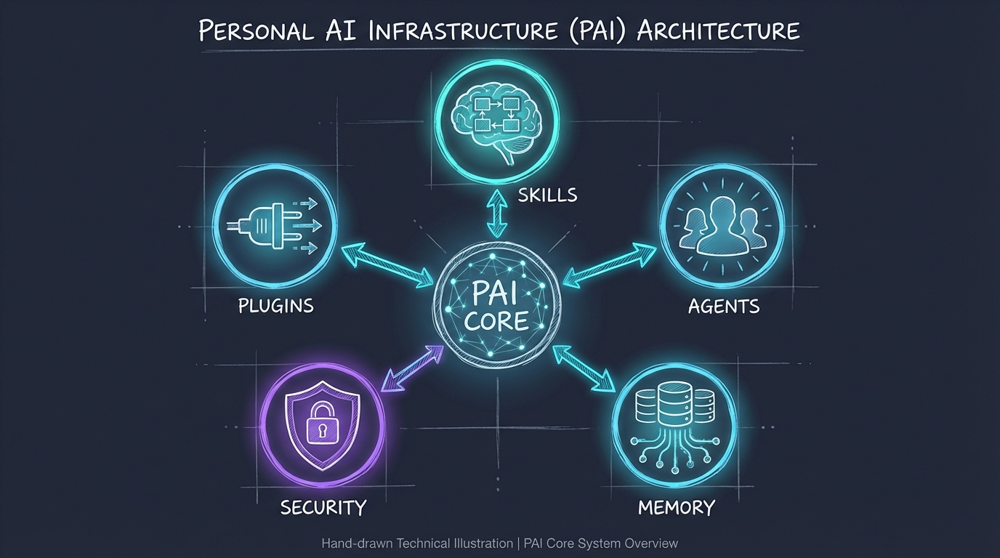
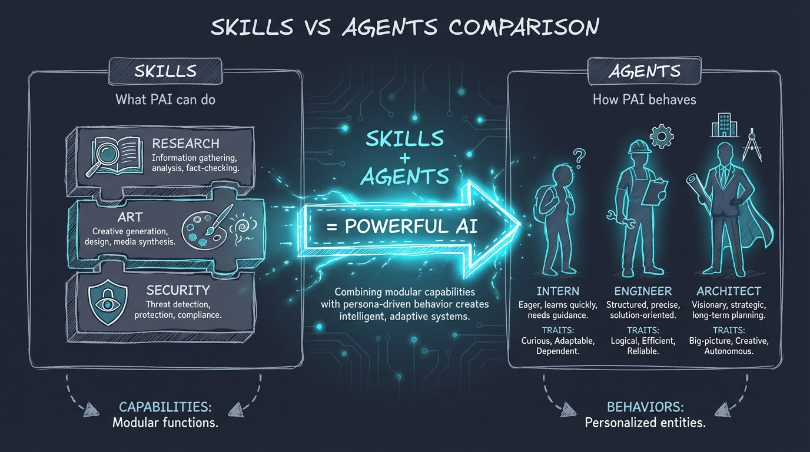

# What is PAI (Personal AI Infrastructure)?

## The Problem

AI assistants are powerful, but they're generic. They don't know your workflow, your preferences, your projects, or your way of thinking. Every conversation starts from zero. You repeat yourself constantly. The AI doesn't remember what matters to you.

**PAI solves this.**

## The Core Insight

> "The scaffolding matters more than the model."
> — Daniel Miessler, creator of PAI

The quality of your AI experience isn't primarily about which language model you use (Claude, GPT-4, Gemini). It's about the **infrastructure** surrounding that model:

- Does it know your identity and preferences?
- Does it have specialized skills for your domain?
- Can it access your context and memory?
- Does it follow your security rules?
- Can it execute complex workflows automatically?

PAI is that infrastructure. It transforms any AI assistant into **your** AI assistant.



## Core Components

### 1. Skills

**Skills** are packaged capabilities that the AI can invoke. Think of them as specialized modes or expert personas.

Examples:
- **CORE**: Defines your identity, preferences, response style (auto-loaded every session)
- **SpecFirst**: 7-phase spec-driven development workflow
- **Security**: Penetration testing and vulnerability scanning
- **Research**: Multi-source information gathering with Fabric patterns
- **Art**: Visual diagram generation with Excalidraw

Skills are defined in Markdown files with YAML frontmatter. They're searchable, composable, and version-controlled.

```yaml
---
name: Security
description: USE WHEN security scan, pentest, vulnerability assessment
---

# Security Skill
[Implementation details...]
```

### 2. Agents

**Agents** are specialized AI instances with distinct personalities, voices, and expertise. Unlike skills (which are instructions), agents are complete personas.

PAI's Agents system supports:
- **Dynamic composition**: Create custom agents on-demand
- **Personality assignment**: 10+ trait combinations (Assertive, Curious, Diplomatic...)
- **Parallel orchestration**: Run multiple agents simultaneously
- **Voice mapping**: Each agent speaks differently

Example: A "Challenge" agent questions your assumptions, while an "Explore" agent researches alternatives—both running in parallel on the same problem.



### 3. Memory

**Memory** gives the AI persistent context across sessions. It's not about chat history—it's about structured knowledge.

Memory types:
- **Projects**: Long-running initiatives with roadmaps, decisions, handoffs
- **Sessions**: Daily work logs with timestamps and outcomes
- **Learning**: Curated insights from past work (what worked, what didn't)
- **State**: Active work tracking (current focus, blockers, next steps)

Memory is stored in Markdown files, making it human-readable and git-friendly.

### 4. Plugins

**Plugins** are TypeScript functions that run at specific lifecycle events:

| Plugin Event | When Triggered | Purpose |
|--------------|----------------|---------|
| `chat.system.transform` | Session start | Load context, inject identity |
| `tool.execute.before` | Before commands | Security validation |
| `tool.execute.after` | After commands | Logging, learning capture |

Plugins transform the AI from a passive chatbot into an **active system** that enforces rules, maintains state, and learns from interactions.

### 5. Security

PAI includes built-in security patterns:

- **Command validation**: Blocks `rm -rf /`, reverse shells, data exfiltration
- **Secret scanning**: Prevents committing API keys, passwords
- **Authorization checks**: Ensures you approve destructive actions
- **Privacy protection**: Validates cross-repo operations

Security isn't an afterthought—it's baked into the infrastructure.

## Why This Matters

### Without PAI:
- "Remember I prefer TypeScript" (every session)
- Copy-paste workflows from notes
- No memory of past decisions
- Generic, one-size-fits-all responses
- Manual safety checks

### With PAI:
- AI already knows your stack and style
- Invoke complex workflows with a single command
- AI references past project decisions
- Personalized responses aligned with your goals
- Automated safety guardrails

## PAI is Scaffolding, Not a Model

PAI doesn't care which AI model you use. It works with:
- Claude (Anthropic)
- GPT-4 (OpenAI)
- Gemini (Google)
- Bedrock (AWS)
- Groq, Mistral, Ollama (local)

The **same PAI infrastructure** makes all of them better at serving **you** specifically.

## Philosophy

PAI embodies a simple principle: **AI assistants should be personal**. Not personalized by a company trying to sell you something—personal because **you** configured them to match **your** needs.

Your skills, your agents, your memory, your rules. Version-controlled. Auditable. Yours.

## Learn More

This document provides a high-level overview. For deep technical details, architecture decisions, and the full PAI philosophy, see:

- **Daniel Miessler's PAI Repository**: [github.com/danielmiessler/Personal_AI_Infrastructure](https://github.com/danielmiessler/Personal_AI_Infrastructure)
- **Fabric Pattern Library**: [github.com/danielmiessler/fabric](https://github.com/danielmiessler/fabric) - 240+ AI patterns for summarization, analysis, and more

PAI is open-source and community-driven. Contributions welcome.

---

**Next:** Learn how [OpenCode's unique features](./OPENCODE-FEATURES.md) make it the ideal platform for running PAI.
