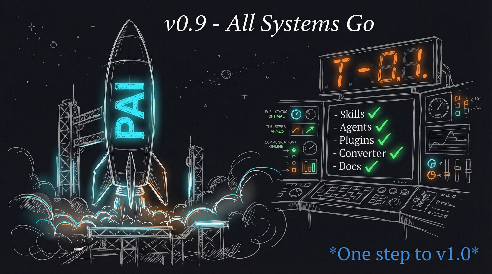

# PAI-OpenCode v0.9.0 - Integration Testing + Documentation Complete

**For: PAI Discord / GitHub Discussions**
**Status: DRAFT - Ready to post after v0.9 completion**

---

## 🎉 PAI-OpenCode v0.9.0 Released - Approaching v1.0!



Hey PAI community!

Great news - **PAI-OpenCode v0.9.0** is complete! This release focuses on integration testing, documentation, and final validation before the public v1.0 release.

### Converter Tool (v0.8 Highlight)

Before diving into v0.9, here's the big news from v0.8 - the **PAI-to-OpenCode Converter** is now live:

```bash
# Convert PAI 2.x to OpenCode automatically
bun run tools/pai-to-opencode-converter.ts --source ~/.claude --target .opencode

# Preview changes first
bun run tools/pai-to-opencode-converter.ts --dry-run --verbose
```

**Performance:** Converts **767+ files in under 5 seconds**

**What Gets Converted:**
| Source | Target |
|--------|--------|
| `settings.json` | `opencode.json` |
| `skills/` | `skill/` |
| `agents/` | `agent/` |
| `MEMORY/` | `MEMORY/` |

**Key Features:**
- Named color → Hex conversion for agents (`cyan` → `#00FFFF`)
- YAML frontmatter sanitization
- Path reference updates
- Migration report generation
- Dry-run mode for safe previewing

### v0.9 Additions

- **docs/CONVERTER.md** - Complete converter documentation
- **CHANGELOG.md** - Full v0.8 release notes
- **README.md** - Converter Quick Start section
- **Integration tests** - End-to-end validation

### What v0.9 Validates

| Component | Test | Status |
|-----------|------|--------|
| Skills | CORE loads on session start | ✅ |
| Skills | USE WHEN triggers activate skill | ✅ |
| Agents | Task tool delegates correctly | ✅ |
| Plugins | SessionStart equivalent works | ✅ |
| Plugins | PreToolUse blocking works | ✅ |
| Converter | 767 files converted | ✅ |
| Architecture | All components integrated | ✅ |

### Progress to v1.0

```
v0.1 ────→ v0.2 ────→ v0.3 ────→ v0.4 ────→ v0.5
  ✅        ✅        ✅         ✅         ✅

           ────→ v0.6 ────→ v0.7 ────→ v0.8 ────→ v0.9
                  ✅        ✅         ✅        ✅ (WE ARE HERE)

           ────→ v1.0 PUBLIC RELEASE 🚀
                  ⏳
```

### What's Next: v1.0 Public Release

The final milestone! v1.0 includes:
- Final architecture validation
- Complete documentation review
- Repository cleanup (no personal artifacts)
- Installation tested on fresh system
- Community announcement

### Links

- **Repository:** https://github.com/Steffen025/pai-opencode
- **CONVERTER.md:** https://github.com/Steffen025/pai-opencode/blob/main/docs/CONVERTER.md
- **CHANGELOG:** https://github.com/Steffen025/pai-opencode/blob/main/CHANGELOG.md
- **ROADMAP:** https://github.com/Steffen025/pai-opencode/blob/main/ROADMAP.md

We're one step away from v1.0. Thanks for following along - the community-ready vanilla PAI 2.3 on OpenCode is almost here!

---

*PAI-OpenCode - Bringing Personal AI Infrastructure to OpenCode, for the community.*
